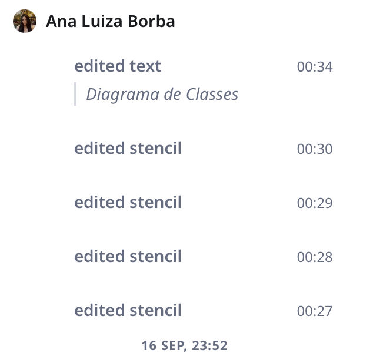
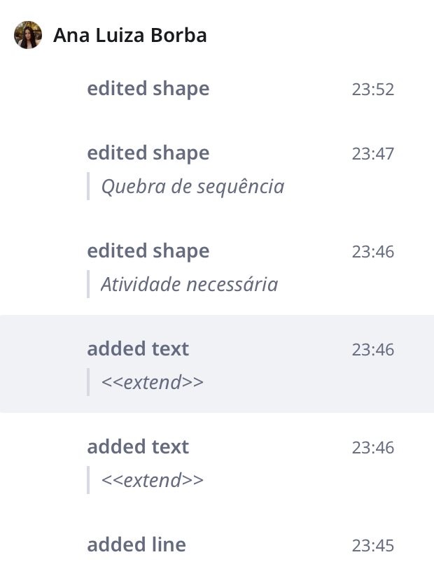
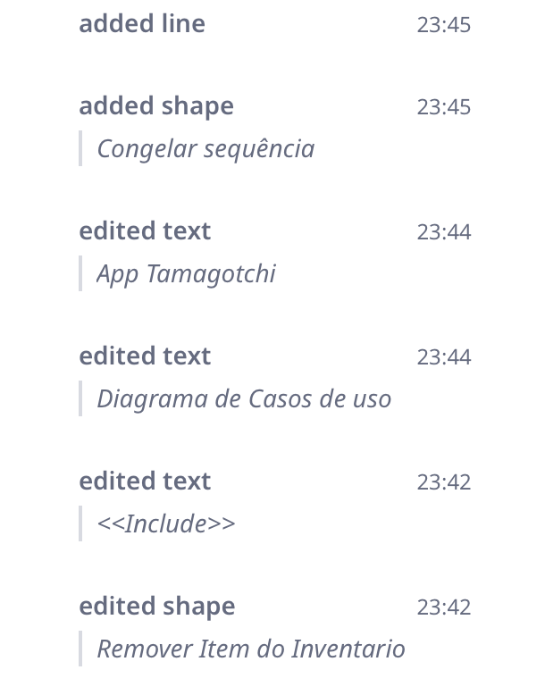
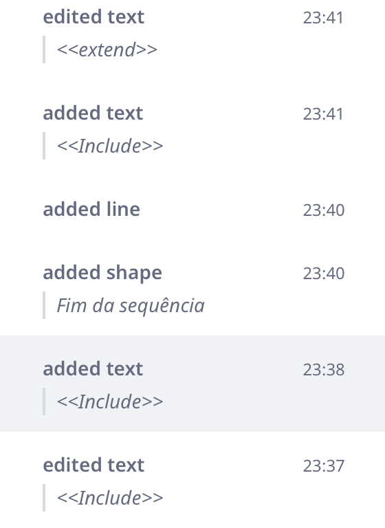
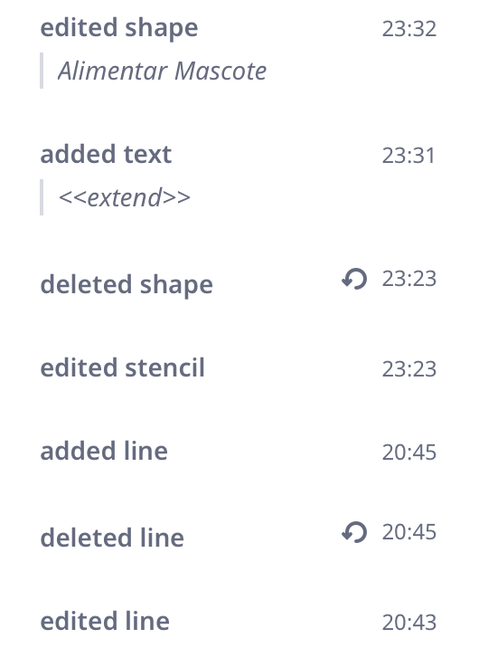
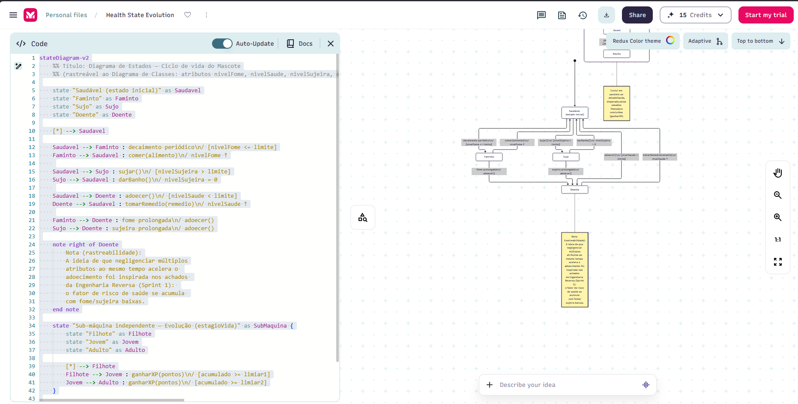
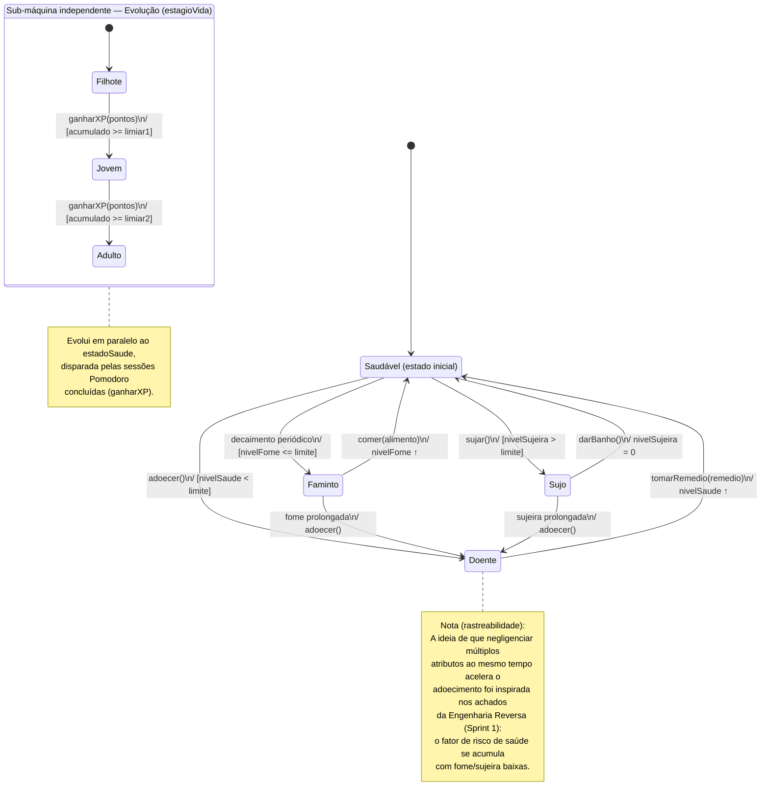
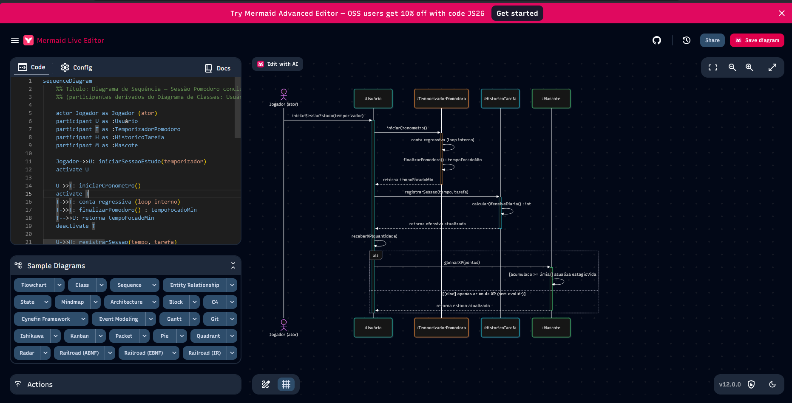
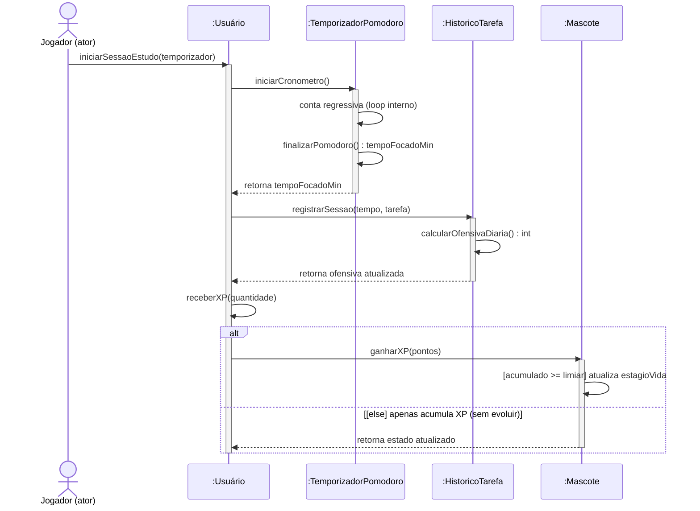

# SubEquipe_02

Esta página reúne as evidências de elaboração dos artefatos da SubEquipe_02 na Entrega 02. O objetivo é registrar o processo de discussão, tomada de decisão, construção dos modelos UML e rastreabilidade entre relatório, participações, reuniões, versionamentos e materiais produzidos.

## Evidências:

### Vínculos no relatório

- [FOCO_01: Modelagem Estática](../Relatórios/1.1.2.SubEquipe_02.md#foco_01-modelagem-estática)
- [Metodologia do Foco_01](../Relatórios/1.1.2.SubEquipe_02.md#metodologia-do-foco_01)
- [Modelo Estático](../Relatórios/1.1.2.SubEquipe_02.md#modelo-estático)
- [FOCO_02: Modelagem Dinâmica](../Relatórios/1.1.2.SubEquipe_02.md#foco_02-modelagem-dinâmica)
- [Diagrama de Estados — Ciclo de vida do Mascote](../Relatórios/1.1.2.SubEquipe_02.md#diagrama-de-estados-ciclo-de-vida-do-mascote)
- [Diagrama de Sequência — Sessão Pomodoro concluída](../Relatórios/1.1.2.SubEquipe_02.md#diagrama-de-sequência-sessão-pomodoro-concluída-xp-e-evolução-do-mascote)
- [Elos entre os modelos](../Relatórios/1.1.2.SubEquipe_02.md#elos-entre-os-modelos)
- [Metodologia do Foco_02](../Relatórios/1.1.2.SubEquipe_02.md#metodologia-do-foco_02)
- [Modelo Dinâmico](../Relatórios/1.1.2.SubEquipe_02.md#modelo-dinâmico)
- [FOCO_03: IA Generativa](../Relatórios/1.1.2.SubEquipe_02.md#foco_03-ia-generativa)
- [Versionamentos](../Relatórios/1.1.2.SubEquipe_02.md#versionamentos)

---

### Gravações das reuniões

| Reunião | Descrição | Link |
|---|---|---|
|  |  |  |

### Atas de reuniões

| Reunião | Descrição | Link |
|---|---|---|
|  |  |  |

### Evidências de elaboração dos artefatos

| Evidência | Artefato relacionado | Link |
|---|---|---|
| Diagrama de Classes | Modelagem Estática | [Visualizar imagem](../assets/subEquipe02/diagramaDeClasses.png) |
| Diagrama de Casos de Uso | Modelagem Dinâmica | [Visualizar imagem](../assets/subEquipe02/diagramaCasosDeUso.png) |
| Melhoria do Diagrama de Casos de Uso | Modelagem Dinâmica | [Visualizar imagem](../assets/subEquipe02/diagramaCasosDeUso.png) |
| Melhoria do Diagrama de Classes | Modelagem Estática | [Visualizar imagem](../assets/subEquipe02/diagramaDeClasses.png) |
| Diagrama de Classes (Especialização de Itens e Sessões) | Modelagem Estática | [Visualizar imagem](../assets/subEquipe02/diagramaDeClasses_v2.png) + [Quadro Miro (Rastro de Construção)](https://miro.com/welcomeonboard/MTZuRXAwVk9ONDF0clZlT1F5eERkdFdsUGE3MjY2SWFWcHpQTTQzOURYalVoenlHWmR0M3Z5OVM4aWEwamxjbXg2cjRpUHhHanVRK1lpS1JwNC9DRCt4akNhV05KdHZ0dm1uc0trRDVaUFVDRjhublZ0YlI3RG1OSFYyL2VlU1NBd044SHFHaVlWYWk0d3NxeHNmeG9BPT0hdjE=?share_link_id=235811381197) |
| Diagrama de Estados do Mascote | Modelagem Dinâmica | [Visualizar imagem](https://github.com/UnBArqDsw2026-2-Turma02/2026.2-T02-_G4_ProjetoJogo_Entrega_02/blob/main/docs/Base/assets/subEquipe02/diagramaDeEstados.png) + [Export do Mermaid Chart (PDF)](https://github.com/UnBArqDsw2026-2-Turma02/2026.2-T02-_G4_ProjetoJogo_Entrega_02/blob/main/docs/Base/assets/subEquipe02/diagramaDeEstadosMermaid.pdf) + [Produção: editor e código](#diagrama-de-estados-produção-no-mermaid-chart) |
| Diagrama de Sequência da sessão Pomodoro | Modelagem Dinâmica | [Visualizar imagem](https://github.com/UnBArqDsw2026-2-Turma02/2026.2-T02-_G4_ProjetoJogo_Entrega_02/blob/main/docs/Base/assets/subEquipe02/diagramaDeSequencia.png) + [Export do Mermaid Chart (PDF)](https://github.com/UnBArqDsw2026-2-Turma02/2026.2-T02-_G4_ProjetoJogo_Entrega_02/blob/main/docs/Base/assets/subEquipe02/diagramaDeSequenciaMermaid.pdf) + [Produção: editor e código](#diagrama-de-sequência-produção-no-mermaid-live-editor) |
| Uso da IA para aprovação do diagrama de casos de uso através da comparação para melhorias, identificado que faltou algumas regras na versão antiga | Modelagem Dinâmica | [Notebook da IA](https://notebook.google.com/notebook/9e5bf25a-5096-48dc-ad75-531c63114d2e) + [Visualizar gravação](https://youtu.be/16QyLsuMeoU)|
| Validação e aprovação do Diagrama de Casos de Uso | Modelagem Dinâmica | [Visualizar imagem](../assets/subEquipe02/diagramaCasosDeUso.png) |
| Aprovação do diagrama de casos de uso através da comparação com a lista de requisitos, identificado que faltou algumas regras na versão antiga | Modelagem Dinâmica | [Visualizar gravação](https://youtu.be/TdkUqtI5khs) |
| Aprovação do diagrama de casos de classes através da comparação com o diagrama de casos de uso e a lista de requisitos, identificado que faltou algumas regras na versão antiga | Modelagem Estática | [Visualizar gravação](https://youtu.be/oHxGYeOGddU) |

### Evidências de produção — Diagramas de Casos de Uso e de Classes

Registro do processo de produção dos Diagramas de Estados e de Sequência, elaborados por [Ana Luiza Borba de Abrantes](https://github.com/luabrantess). Para cada diagrama há a captura do editor utilizado, Miro, que permite construir diagramas.

A consolidação da modelagem deu-se com a elaboração do diagrama de classes final, projetado com base nos requisitos elicitaos, refinamentos refinados via Inteligência Artificial e nas diretrizes apresentadas na disciplina ("Arquitetura e Desenho de Software - Aula Modelagem UML Estática"). A construção da arquitetura orientada a objetos sustentou-se nas práticas descritas por Larman (2007), estruturando o mapeamento das entidades essenciais do domínio — como o gerenciador de ciclos Pomodoro e o mecanismo de evolução do bichinho virtual. Além disso, a aplicação rigorosa dos relacionamentos estáticos (herança, composição e agregação) e dos níveis de visibilidade garantiu a consistência das abstrações necessárias, fundamentando-se nas abordagens clássicas de engenharia e metodologias de design de software (Pfleeger, 2004; Zhu, 2005; Colorado.edu, 2008).

Diagrama final: [Figura 4 do relatório](../Relatórios/1.1.2.SubEquipe_02.md#modelo-estático).

Diagrama final: [Figura 4 do relatório](../Relatórios/1.1.2.SubEquipe_02.md#diagrama-de-casos-de-uso).

### Evidências de produção — Diagramas de Estados e de Sequência

Registro do processo de produção dos Diagramas de Estados e de Sequência, elaborados por [João Vitor Mendonça Merlin](https://github.com/jvopBR). Para cada diagrama há a captura do editor utilizado, com o código Mermaid e a pré-visualização lado a lado, e o código-fonte completo, que permite reproduzir o diagrama em qualquer editor Mermaid.

#### Diagrama de Estados — produção no Mermaid Chart

Diagrama final: [Figura 4 do relatório](../Relatórios/1.1.2.SubEquipe_02.md#diagrama-de-estados-ciclo-de-vida-do-mascote).

  
<b>Figura 1:</b> Produção do Diagrama de Estados no Mermaid Chart — código à esquerda e pré-visualização à direita.

  
<b>Fonte:</b> <a href="https://github.com/jvopBR" target="_blank">João Vitor Mendonça Merlin</a>, 2026.

Código-fonte Mermaid — Diagrama de Estados (48 linhas)

#### Diagrama de Sequência — produção no Mermaid Live Editor

Diagrama final: [Figura 5 do relatório](../Relatórios/1.1.2.SubEquipe_02.md#diagrama-de-sequência-sessão-pomodoro-concluída-xp-e-evolução-do-mascote).

  
<b>Figura 2:</b> Produção do Diagrama de Sequência no Mermaid Live Editor — código à esquerda e pré-visualização à direita.

  
<b>Fonte:</b> <a href="https://github.com/jvopBR" target="_blank">João Vitor Mendonça Merlin</a>, 2026.

Código-fonte Mermaid — Diagrama de Sequência (37 linhas)

### Comprobatórios de commits e versionamentos

| Data | Autor | Descrição | Link |
|---|---|---|---|
| 15/09/2026 | Pablo Cunha de Jesus | Elaboração do Diagrama de Classes e do Diagrama de Casos de Uso | [Versionamento no relatório](../Relatórios/1.1.2.SubEquipe_02.md#versionamentos) |
| 16/09/2026 | Ana Luiza Borba de Abrantes | Melhoria e Aprovação do Diagrama de Classes e do Diagrama de Casos de Uso | [Versionamento no relatório](../Relatórios/1.1.2.SubEquipe_02.md#versionamentos) |
| 17/09/2026 | Ana Luiza Borba de Abrantes | Commit das melhorias | [Commit f528415](https://github.com/UnBArqDsw2026-2-Turma02/2026.2-T02-_G4_ProjetoJogo_Entrega_02/commit/f52841515b29d0909f779c8ea1714ee23b70aed0) |
| 17/09/2026 | Danilo Sarmento Barros | Elaboração do Diagrama de Classes v2 (especialização de Itens e Sessões de Estudo) e inclusão de participante | [Commit 8e70404](https://github.com/UnBArqDsw2026-2-Turma02/2026.2-T02-_G4_ProjetoJogo_Entrega_02/commit/8e70404a5c933d3158c71e646e5416040d8b7a6f) |
| 17/09/2026 | Danilo Sarmento Barros | Merge da branch docs/subgrupo2 na main integrando o Diagrama de Classes v2 | [Commit f528415](https://github.com/UnBArqDsw2026-2-Turma02/2026.2-T02-_G4_ProjetoJogo_Entrega_02/commit/f52841515b29d0909f779c8ea1714ee23b70aed0) |
| 17/09/2026 | Danilo Sarmento Barros | Adição de legendas padronizadas e link do Miro para rastreabilidade do diagrama de classes | [Commit 6f074a7](https://github.com/UnBArqDsw2026-2-Turma02/2026.2-T02-_G4_ProjetoJogo_Entrega_02/commit/6f074a7f058ee9d41d132b49dfd1f39185a6fc3c) |
| 17/09/2026 | Danilo Sarmento Barros | Merge da branch docs/subgrupo2 na main integrando as legendas e rastros do Miro | [Commit c0143dd](https://github.com/UnBArqDsw2026-2-Turma02/2026.2-T02-_G4_ProjetoJogo_Entrega_02/commit/c0143dddf24a1ff9286eb7ea0a9e5caad6e7b51b) |
| 17/09/2026 | Pablo Cunha de Jesus | Adição do Diagrama de Estados e do Diagrama de Sequência | [Commit 77576e9](https://github.com/UnBArqDsw2026-2-Turma02/2026.2-T02-_G4_ProjetoJogo_Entrega_02/commit/77576e90f4a40b4b1105b511e1f4e515b85d69d0) |
| 17/09/2026 | Pablo Cunha de Jesus | Alteração do tipo de arquivo (Diagrama de Estado e Sequencia) | [Commit 96e7a71](https://github.com/UnBArqDsw2026-2-Turma02/2026.2-T02-_G4_ProjetoJogo_Entrega_02/commit/96e7a71eb6a90762642b73df8e595b01afd0a3e8) |
| 17/09/2026 | Pablo Cunha de Jesus | Inclusão do Foco 03 - Minhas Lições aprendidas e Uso de IA Generativa | [Commit d05ccbf](https://github.com/UnBArqDsw2026-2-Turma02/2026.2-T02-_G4_ProjetoJogo_Entrega_02/commit/d05ccbff9a8cebedf327feac0885caffce5e6666)|
| 17/09/2026 | Danilo Sarmento Barros | Validação e aprovação do Diagrama de Casos de Uso e relato no Foco 03 (IA Generativa) | [Versionamento no relatório](../Relatórios/1.1.2.SubEquipe_02.md#versionamentos) |
| 18/09/2026 | Ana Luiza Borba de Abrantes | Edição dos textos do foco 1 com base nas referências da professora | [Versionamento no relatório](../Relatórios/1.1.2.SubEquipe_02.md#versionamentos) |

