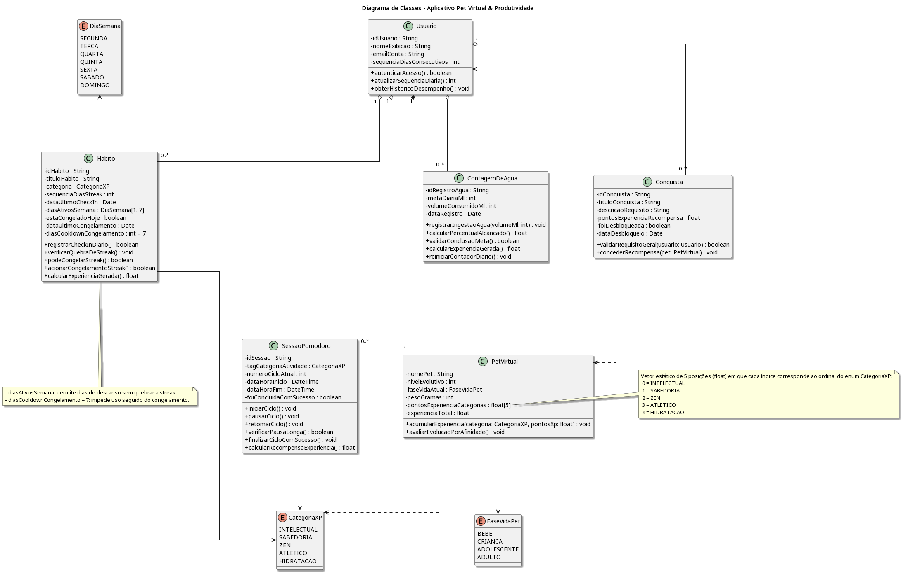
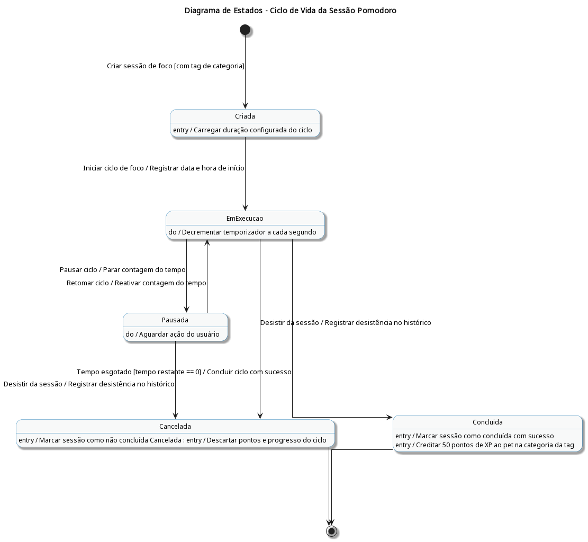
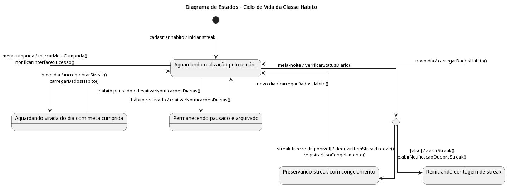
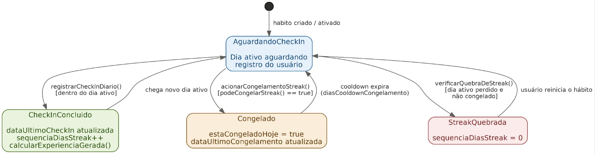

# SubEquipe_03

Esta página reúne as evidências de elaboração dos artefatos da SubEquipe_03 na Entrega 02. O objetivo é registrar o processo de discussão, tomada de decisão, construção dos modelos UML e rastreabilidade entre relatório, participações, reuniões, versionamentos e materiais produzidos.

## Evidências:

### Vínculos no relatório

- [FOCO_01: Modelagem Estática](../Relatórios/1.1.3.SubEquipe_03.md#foco_01-modelagem-estática)
- [Metodologia do Foco_01](../Relatórios/1.1.3.SubEquipe_03.md#metodologia-do-foco_01)
- [Modelo Estático](../Relatórios/1.1.3.SubEquipe_03.md#modelo-estático)
- [FOCO_02: Modelagem Dinâmica](../Relatórios/1.1.3.SubEquipe_03.md#foco_02-modelagem-dinâmica)
- [Metodologia do Foco_02](../Relatórios/1.1.3.SubEquipe_03.md#metodologia-do-foco_02)
- [Modelo Dinâmico](../Relatórios/1.1.3.SubEquipe_03.md#modelo-dinâmico)
- [FOCO_03: IA Generativa](../Relatórios/1.1.3.SubEquipe_03.md#foco_03-ia-generativa)
- [Versionamentos](../Relatórios/1.1.3.SubEquipe_03.md#versionamentos)

---

### Gravações das reuniões

#### Reunião 0 - Reunião Geral de Alinhamento (Preparação Entrega 2)

Nesta reunião preparatória para a segunda entrega, oficializou-se a nova formação do Subgrupo 03 (Eduardo, Gabriel e Weverton), após a ida de Guilherme para o Subgrupo 01. A equipe redirecionou o escopo do projeto, priorizando o caráter de utilitário de produtividade em vez de um jogo tradicional. Além de discutirem a produção das artes e a evolução do pet virtual, o grupo acatou a proposta de Weverton de ranquear os requisitos para definir o escopo de um Produto Mínimo Viável (MVP).

[Link da gravação](https://www.youtube.com/watch?v=pVNnEgEuTOM)

<iframe
  width="560"
  height="315"
  src="https://www.youtube.com/embed/pVNnEgEuTOM"
  title="Reunião 13/09/2026 (SubGrupo 03) - Alinhamento Inicial e Seleção de Diagramas"
  frameborder="0"
  allow="accelerometer; autoplay; clipboard-write; encrypted-media; gyroscope; picture-in-picture; web-share"
  allowfullscreen>
</iframe>

#### Reunião 1 - Alinhamento Inicial e Seleção de Diagramas UML

Nesta reunião, o subgrupo realizou o alinhamento estratégico para a Entrega 2. A equipe discutiu o cronograma de trabalho, a divisão das tarefas da semana e a seleção dos artefatos a serem desenvolvidos. Definiu-se que a modelagem estática seria representada pelo Diagrama de Classes, aproveitando e evoluindo as abstrações desenvolvidas no Mapa Mental da entrega anterior, enquanto a modelagem dinâmica seria representada pelo Diagrama de Estados.

[Link da gravação](https://www.youtube.com/watch?v=gylh3ae4QDE)

<iframe
  width="560"
  height="315"
  src="https://www.youtube.com/embed/gylh3ae4QDE"
  title="Reunião 13/09/2026 (SubGrupo 03) - Alinhamento Inicial e Seleção de Diagramas"
  frameborder="0"
  allow="accelerometer; autoplay; clipboard-write; encrypted-media; gyroscope; picture-in-picture; web-share"
  allowfullscreen>
</iframe>

#### Reunião 2 - Modelagem Inicial do Diagrama de Classes e Redefinição de Escopo 

Nesta sessão, a equipe iniciou a construção do Diagrama de Classes UML. Durante a discussão sobre o escopo do produto, o grupo decidiu alterar o conceito inicialmente baseado no modelo tradicional de *Tamagotchi*, que envolvia cuidados biológicos simulados, como banho, dejetos e medicamentos, além de um fluxo de loja com moedas. A proposta foi redefinida como um utilitário gamificado voltado à produtividade e ao acompanhamento de hábitos reais. Nesse processo, foram mapeadas as principais entidades do domínio (`Usuario`, `PetVirtual`, `SessaoPomodoro`, `ContagemDeAgua` e `Conquista`), com a definição inicial de seus atributos e métodos.

[Link da gravação](https://www.youtube.com/watch?v=8FaBwHPtJd8)

<iframe
  width="560"
  height="315"
  src="https://www.youtube.com/embed/8FaBwHPtJd8"
  title="Reunião 14/09/2026 (SubGrupo 03) - Modelagem do Diagrama de Classes"
  frameborder="0"
  allow="accelerometer; autoplay; clipboard-write; encrypted-media; gyroscope; picture-in-picture; web-share"
  allowfullscreen>
</iframe>

#### Reunião 3 (parte 01) - Refinamento do Diagrama de Classes e Validação dos Relacionamentos 

Nesta primeira parte da reunião do dia 15, o subgrupo realizou a revisão técnica das conexões do Diagrama de Classes. A equipe reavaliou o uso de composições e agregações, além de ajustar as multiplicidades e as linhas de dependência. Também foi deliberado o isolamento das enumerações no modelo, mantendo-as como tipos de atributos das classes para reduzir a sobrecarga visual do diagrama. Em seguida, iniciou-se a transição para a modelagem dinâmica. 

[Link da gravação](https://www.youtube.com/watch?v=03ttnRP_WUM)

<iframe
  width="560"
  height="315"
  src="https://www.youtube.com/embed/03ttnRP_WUM"
  title="Reunião 15/09/2026 (SubGrupo 03) - Parte 1: Refinamento do Diagrama de Classes"
  frameborder="0"
  allow="accelerometer; autoplay; clipboard-write; encrypted-media; gyroscope; picture-in-picture; web-share"
  allowfullscreen>
</iframe>

#### Reunião 3 (parte 02) - Construção do Diagrama de Estados da Sessão Pomodoro

 Na segunda parte da reunião do dia 15, o foco concentrou-se na elaboração do Diagrama de Estados para o ciclo de vida do fluxo de `SessaoPomodoro`. A equipe modelou o passo a passo desde a configuração inicial (seleção de categoria de XP e tempos), utilizando nós de bifurcação e junção (*fork/join*), transições de execução, manipulação de pausas curtas e longas, pontuação de experiência e tratamento de encerramento/cancelamento pelo usuário. 
 
 [Link da gravação](https://www.youtube.com/watch?v=ndVvvg-Kmm0)

 <iframe
  width="560"
  height="315"
  src="https://www.youtube.com/embed/ndVvvg-Kmm0"
  title="Reunião 15/09/2026 (SubGrupo 03) - Parte 2: Diagrama de Estados"
  frameborder="0"
  allow="accelerometer; autoplay; clipboard-write; encrypted-media; gyroscope; picture-in-picture; web-share"
  allowfullscreen>
</iframe>

#### Reunião 4 (parte 03) — Ajustes e Finalização do Diagrama de Estados do Pomodoro

Nesta terceira parte da reunião, a equipe concentrou-se nos refinamentos finais do Diagrama de Estados do `Pomodoro`. O debate principal girou em torno da aplicação correta dos nós de decisão (`gateways`) para gerenciar o encerramento dos ciclos e o comportamento das opções de `pausa longa`. A equipe ajustou a semântica visual do diagrama conforme orientações recebidas em *feedback*, adicionando perguntas de contexto junto aos nós e respostas diretas nas transições, diferenciando conceitualmente a ação de "iniciar novo ciclo" da ação de "encerrar sessão". Por fim, o grupo deliberou sobre os próximos passos da entrega: a modelagem de estados do `Pet Virtual` foi descartada por se assemelhar a um fluxograma lógico simples, e a classe de `Hábitos` foi definida como o alvo do próximo Diagrama de Estados.

 [Link da gravação](https://www.youtube.com/watch?v=ZzBQCSW4hEg)

 <iframe
  width="560"
  height="315"
  src="https://www.youtube.com/embed/ZzBQCSW4hEg"
  title="Reunião 16/09/2026 (SubGrupo 03)  - Parte 3: Ajustes e Finalização do Diagrama de Estados do Pomodoro"
  frameborder="0"
  allow="accelerometer; autoplay; clipboard-write; encrypted-media; gyroscope; picture-in-picture; web-share"
  allowfullscreen>
</iframe>

#### Reunião 5 — Modelagem e Finalização do Diagrama de Estados de Hábitos

Nesta reunião, a equipe concentrou-se no desenvolvimento e refinamento do Diagrama de Estados para a classe de `Hábitos`. O debate principal girou em torno de como modelar corretamente o passo inicial de configuração. A equipe decidiu implementar um estado composto (subfluxo) nomeado como `Estruturando Hábito`, que engloba a seleção dos dias ativos e da categoria em paralelo, antes de entrar no fluxo de verificação diária.

 [Link da gravação](https://www.youtube.com/watch?v=mQnqx_Op6tA)

 <iframe
  width="560"
  height="315"
  src="https://www.youtube.com/embed/mQnqx_Op6tA"
  title="Reunião 16/09/2026 (SubGrupo 03): Modelagem e Finalização do Diagrama de Estados de Hábitos"
  frameborder="0"
  allow="accelerometer; autoplay; clipboard-write; encrypted-media; gyroscope; picture-in-picture; web-share"
  allowfullscreen>
</iframe>

#### Reunião 6 — Alinhamento Geral dos Subgrupos (Entrega 02)

A equipe alinhou os relatórios e a matriz de rastreabilidade dos diagramas, consolidando o projeto como um utilitário mobile gamificado. Para enxugar o MVP, a loja de cosméticos foi substituída por um sistema de conquistas e insígnias, mantendo o ganho de XP via Pomodoro e os hábitos influenciando os atributos do pet. Por fim, definiu-se o versionamento dos requisitos e a logística para a gravação do vídeo da entrega.

 [Link da gravação](https://www.youtube.com/watch?v=6-s-Gk3eAHE)

  <iframe
  width="560"
  height="315"
  src="https://www.youtube.com/embed/6-s-Gk3eAHE"
  title="Reunião de Alinhamento Geral dos Subgrupos (Entrega 02)"
  frameborder="0"
  allow="accelerometer; autoplay; clipboard-write; encrypted-media; gyroscope; picture-in-picture; web-share"
  allowfullscreen>
</iframe>

#### Reunião 7 — Finalização de Relatórios, Evidências e Documentação de IA

Nessa reunião foi feito a estruturação da página de evidências, correção de links e exibição dos diagramas, refinamento do relatório de uso de IA Generativa, registro de commits/participações e organização final dos artefatos.

 [Link da gravação](https://www.youtube.com/watch?v=8df44He7TtY)

  <iframe
  width="560"
  height="315"
  src="https://www.youtube.com/embed/8df44He7TtY"
  title="Reunião de Alinhamento Geral dos Subgrupos (Entrega 02)"
  frameborder="0"
  allow="accelerometer; autoplay; clipboard-write; encrypted-media; gyroscope; picture-in-picture; web-share"
  allowfullscreen>
</iframe>

### Atas de reuniões

<table>
  <thead>
    <tr>
      <th>Reunião</th>
      <th>Descrição</th>
      <th>Link</th>
    </tr>
  </thead>
  <tbody>
    <tr>
      <td>Reunião 11/09/2026 (SubGrupo 01, 02 e 03)</td>
      <td>alinhamento geral para o início da segunda entrega, reestruturação da formação dos subgrupos, redefinição do escopo (foco utilitário) e planejamento do Produto Mínimo Viável (MVP).</td>
      <td><label class="ata-link" for="ata-0">Abrir ata</label></td>
    </tr>
    <tr>
      <td>Reunião 13/09/2026 (SubGrupo 03)</td>
      <td>Registro da reunião de alinhamento do planejamento da Entrega 2 e escolha dos diagramas UML.</td>
      <td><label class="ata-link" for="ata-1">Abrir ata</label></td>
    </tr>
    <tr>
      <td>Reunião 14/09/2026 (SubGrupo 03)</td>
      <td>Registro da reunião de mapeamento inicial das classes e discussão sobre a redefinição do escopo do produto.</td>
      <td><label class="ata-link" for="ata-2">Abrir ata</label></td>
    </tr>
    <tr>
      <td>Reunião 15/09/2026 (SubGrupo 03) - Parte 1</td>
      <td>Registro da reunião de revisão de relacionamentos, multiplicidades e dependências do Diagrama de Classes.</td>
      <td><label class="ata-link" for="ata-3">Abrir ata</label></td>
    </tr>
    <tr>
      <td>Reunião 15/09/2026 (SubGrupo 03) - Parte 2</td>
      <td>Registro da reunião de construção da modelagem dinâmica por meio do Diagrama de Estados da classe <code>SessaoPomodoro</code>.</td>
      <td><label class="ata-link" for="ata-4">Abrir ata</label></td>
    </tr>
    <tr>
      <td>Reunião 16/09/2026 (SubGrupo 03) - Parte 3</td>
      <td>Registro da reunião da finlização da construção da modelagem dinâmica por meio do Diagrama de Estados da classe <code>SessaoPomodoro</code>.</td>
      <td><label class="ata-link" for="ata-5">Abrir ata</label></td>
    </tr>
      <tr>
      <td>Reunião 16/09/2026 (SubGrupo 03)</td>
      <td>Desenvolvimento e finalização do Diagrama de Estados da classe <code>Habito</code>, abrangendo o cadastro, a verificação diária, o gerenciamento de pausas e congelamentos e as transições de edição.</td>
      <td><label class="ata-link" for="ata-6">Abrir ata</label></td>
    </tr>
    </tr>
      <tr>
      <td>Reunião de Alinhamento Geral dos Subgrupos (Entrega 02)</td>
      <td>Finalizaçãp da documentação dos diagramas, enxugou o MVP substituindo a loja por um sistema de conquistas e alinhou o versionamento dos requisitos e a gravação do vídeos das entregas.</td>
      <td><label class="ata-link" for="ata-7">Abrir ata</label></td>
    </tr>
    </tr>
      <tr>
      <td>Finalização de Relatórios, Evidências e Documentação de IA</td>
      <td>Estruturação da página de evidências, correção de links e exibição dos diagramas, refinamento do relatório de uso de IA Generativa.</td>
      <td><label class="ata-link" for="ata-8">Abrir ata</label></td>
    </tr>
  </tbody>
</table>

<input class="ata-toggle" type="checkbox" id="ata-0">

  <label class="ata-modal-backdrop" for="ata-0"></label>
  <section class="ata-modal-content" aria-labelledby="ata-0-title">
    <label class="ata-modal-close" for="ata-0" aria-label="Fechar ata">x</label>
    <h3 id="ata-0-title">Ata - Reunião Geral de Alinhamento (Preparação Entrega 2)</h3>
    
<strong>Projeto:</strong> G4 - Projeto Jogo

    
<strong>Disciplina:</strong> Arquitetura e Desenho de Software

    
<strong>Participantes:</strong> Ana Luiza, Arthur, Danilo, Eduardo Ribeiro, Enzo, Gabriel Pereira, Pablo e Weverton Rodrigues.

    
<strong>Pauta:</strong> alinhamento geral para o início da segunda entrega, reestruturação da formação dos subgrupos, redefinição do escopo (foco utilitário) e planejamento do Produto Mínimo Viável (MVP).

    
<strong>Resumo:</strong> a reunião contou com a presença de integrantes de múltiplos subgrupos para definir os próximos passos do projeto. Inicialmente, foi registrada a alteração na composição do Subgrupo 03, que passa a ter três membros (Eduardo, Gabriel e Weverton) após a ida de Guilherme para o Subgrupo 01. O foco do debate foi o reposicionamento do produto, com o grupo decidindo que a aplicação deve priorizar as funcionalidades de um utilitário em detrimento de mecânicas convencionais de jogo. Foram debatidas as possibilidades de evolução do pet virtual e a viabilização das artes gráficas. Durante a discussão, Weverton sugeriu a priorização (ranqueamento) dos requisitos para a elaboração de um MVP, ideia que foi bem recebida para guiar o desenvolvimento.

    
<strong>Encaminhamentos:</strong> ranquear e priorizar a lista de requisitos para compor o escopo do MVP, ajustar as especificações do produto para refletir a mudança de foco (de jogo para utilitário gamificado) e definir as ferramentas/responsáveis pela produção das artes gráficas do pet.

    
<strong>Artefatos abordados:</strong> Documento de Visão/Escopo, Lista de Requisitos e Planejamento de MVP.

  </section>

<input class="ata-toggle" type="checkbox" id="ata-1">

  <label class="ata-modal-backdrop" for="ata-1"></label>
  <section class="ata-modal-content" aria-labelledby="ata-1-title">
    <label class="ata-modal-close" for="ata-1" aria-label="Fechar ata">x</label>
    <h3 id="ata-1-title">Ata - Reunião 13/09/2026 (SubGrupo 03)</h3>
    
<strong>Projeto:</strong> G4 - Projeto Jogo

    
<strong>Disciplina:</strong> Arquitetura e Desenho de Software

    
<strong>Participantes:</strong> Eduardo Ribeiro Gomes da Silva, Gabriel Pereira da Silva e Weverton Rodrigues da Costa Silva.

    
<strong>Pauta:</strong> alinhar o planejamento para a Entrega 2, definir a divisão de tarefas da subequipe e escolher os diagramas UML que seriam elaborados.

    
<strong>Resumo:</strong> os membros discutiram o cronograma e os requisitos da Entrega 2 (Modelagem UML). Foi decidido focar a modelagem estática no Diagrama de Classes, reaproveitando e evoluindo as abstrações e os conceitos definidos na entrega anterior, e a modelagem dinâmica no Diagrama de Estados.

    
<strong>Encaminhamentos:</strong> iniciar o mapeamento das classes em PlantUML na reunião seguinte, verificar dúvidas com a professora durante a aula e organizar a estrutura dos arquivos de documentação e das evidências no GitHub Pages.

    
<strong>Artefatos abordados:</strong> Planejamento da Entrega 2, seleção dos diagramas UML (Classes e Estados) e estrutura de documentação.

  </section>

<input class="ata-toggle" type="checkbox" id="ata-2">

  <label class="ata-modal-backdrop" for="ata-2"></label>
  <section class="ata-modal-content" aria-labelledby="ata-2-title">
    <label class="ata-modal-close" for="ata-2" aria-label="Fechar ata">x</label>
    <h3 id="ata-2-title">Ata - Reunião 14/09/2026 (SubGrupo 03)</h3>
    
<strong>Projeto:</strong> G4 - Projeto Jogo

    
<strong>Disciplina:</strong> Arquitetura e Desenho de Software

    
<strong>Participantes:</strong> Eduardo Ribeiro Gomes da Silva, Gabriel Pereira da Silva e Weverton Rodrigues da Costa Silva.

    
<strong>Pauta:</strong> iniciar a construção do Diagrama de Classes UML e alinhar as regras de negócio e o escopo do produto.

    
<strong>Resumo:</strong> a subequipe realizou uma discussão sobre a identidade e o escopo do produto. Gabriel defendeu a manutenção dos cuidados biológicos clássicos, como alimentação simulada, limpeza de resíduos, saúde e fluxo de loja com moedas, enquanto Weverton e Eduardo defenderam a redefinição da aplicação como um utilitário gamificado voltado à produtividade e aos hábitos reais. Chegou-se ao consenso de descartar a manutenção biológica artificial e concentrar o crescimento do pet em ações concretas do usuário, como sessões de Pomodoro, acompanhamento de hábitos e ingestão de água. A modelagem das classes foi iniciada conjuntamente pelos integrantes, com a definição das principais entidades e de suas características. Na continuidade do trabalho, Weverton ficou responsável pela finalização das abstrações que ainda estavam pendentes no modelo.

    
<strong>Encaminhamentos:</strong> concluir a especificação das classes em PlantUML, delegar o desenho dos relacionamentos e das multiplicidades para Eduardo e Gabriel e agendar a reunião de revisão.

    
<strong>Artefatos abordados:</strong> Escopo do produto, Diagrama de Classes UML, enumerações de apoio e arquivo <code>diagrama-classes.puml</code>.

  </section>

<input class="ata-toggle" type="checkbox" id="ata-3">

  <label class="ata-modal-backdrop" for="ata-3"></label>
  <section class="ata-modal-content" aria-labelledby="ata-3-title">
    <label class="ata-modal-close" for="ata-3" aria-label="Fechar ata">x</label>
    <h3 id="ata-3-title">Ata - Reunião 15/09/2026 (SubGrupo 03) - Parte 1</h3>
    
<strong>Projeto:</strong> G4 - Projeto Jogo

    
<strong>Disciplina:</strong> Arquitetura e Desenho de Software

    
<strong>Participantes:</strong> Eduardo Ribeiro Gomes da Silva, Gabriel Pereira da Silva e Weverton Rodrigues da Costa Silva.

    
<strong>Pauta:</strong> revisar e validar os relacionamentos, multiplicidades e dependências do Diagrama de Classes.

    
<strong>Resumo:</strong> o grupo analisou a primeira versão das conexões propostas por Eduardo e Gabriel. Foram reavaliados os tipos de relacionamento, com a definição do uso de composição para entidades cujos ciclos de vida dependem estritamente do perfil do usuário, como <code>PetVirtual</code>, <code>Habito</code> e <code>SessaoPomodoro</code>, e de agregação para o catálogo de conquistas. Também foram ajustadas as multiplicidades e as linhas de dependência para representar chamadas de métodos, como o envio de experiência ao <code>PetVirtual</code>. Por fim, deliberou-se não desenhar linhas explícitas de relacionamento para as enumerações, com o objetivo de preservar a clareza visual do modelo.

    
<strong>Encaminhamentos:</strong> gerar a versão final do diagrama (<code>diagrama-classes-sub3.png</code>), validar a notação PlantUML e iniciar a elaboração do diagrama de estados.

    
<strong>Artefatos abordados:</strong> Diagrama de Classes UML (<code>diagrama-classes-sub3.png</code>), relacionamentos (composição, agregação e dependência) e multiplicidades.

  </section>

<input class="ata-toggle" type="checkbox" id="ata-4">

  <label class="ata-modal-backdrop" for="ata-4"></label>
  <section class="ata-modal-content" aria-labelledby="ata-4-title">
    <label class="ata-modal-close" for="ata-4" aria-label="Fechar ata">x</label>
    <h3 id="ata-4-title">Ata - Reunião 15/09/2026 (SubGrupo 03) - Parte 2</h3>
    
<strong>Projeto:</strong> G4 - Projeto Jogo

    
<strong>Disciplina:</strong> Arquitetura e Desenho de Software

    
<strong>Participantes:</strong> Eduardo Ribeiro Gomes da Silva, Gabriel Pereira da Silva e Weverton Rodrigues da Costa Silva.

    
<strong>Pauta:</strong> modelar o comportamento dinâmico do ciclo de vida da classe <code>SessaoPomodoro</code> por meio de um Diagrama de Estados UML.

    
<strong>Resumo:</strong> a equipe construiu o Diagrama de Estados para detalhar as transições do temporizador Pomodoro. Foram mapeados o estado inicial, o nó de bifurcação (<code>fork</code>) para a seleção de categorias e configurações de tempo, o estado de execução do foco, o gerenciamento de pausas curtas e longas após três ciclos normais, a concessão de XP ao término do foco e o tratamento de encerramento antecipado ou cancelamento pelo usuário, sem retenção indevida de progresso.

    
<strong>Encaminhamentos:</strong> documentar as regras de transição de estados, detalhar as justificativas metodológicas e integrar a modelagem dinâmica ao relatório final e às evidências.

    
<strong>Artefatos abordados:</strong> Diagrama de Estados UML (<code>SessaoPomodoro</code>), nó de bifurcação, transições de pausa curta e longa e atribuição de experiência.

  </section>

<input class="ata-toggle" type="checkbox" id="ata-5">

  <label class="ata-modal-backdrop" for="ata-5"></label>
  <section class="ata-modal-content" aria-labelledby="ata-5-title">
    <label class="ata-modal-close" for="ata-5" aria-label="Fechar ata">x</label>
    <h3 id="ata-5-title">Ata - Reunião 16/09/2026 (SubGrupo 03)</h3>
    
<strong>Projeto:</strong> G4 - Projeto Jogo

    
<strong>Disciplina:</strong> Arquitetura e Desenho de Software

    
<strong>Participantes:</strong> Eduardo Ribeiro Gomes da Silva, Gabriel Pereira da Silva e Weverton Rodrigues da Costa Silva.

    
<strong>Pauta:</strong> finalizar a modelagem do Diagrama de Estados do Pomodoro (<code>SessãoPomodoro</code>), alinhar a semântica visual dos nós de decisão (<em>gateways</em>) e definir o escopo dos próximos artefatos da entrega.

    
<strong>Resumo:</strong> a equipe ajustou e finalizou o Diagrama de Estados do Pomodoro, discutindo a aplicação de <em>gateways</em> para representar decisões após a conclusão de atividades e durante as pausas. Os nós de decisão foram utilizados para representar a escolha entre iniciar um novo ciclo ou encerrar a sessão. Conforme o <em>feedback</em> da professora, foram adicionadas perguntas de contexto próximas aos losangos de decisão e respostas diretas nas setas de transição. Também foi realizado um alinhamento conceitual entre os termos <code>ciclo</code> e <code>sessão</code> de Pomodoro para garantir a correta definição das transições.

    
<strong>Encaminhamentos:</strong> Eduardo ficará responsável por redigir a parte metodológica do relatório referente ao Diagrama de Estados. A equipe também deverá elaborar o segundo Diagrama de Estados, agora focado na classe de <code>Hábitos</code>, revisar os links quebrados apontados no <em>feedback</em> da professora e concluir as demais documentações e requisitos pendentes da entrega.

    
<strong>Artefatos abordados:</strong> Diagrama de Estados UML (Sessão Pomodoro), nós de decisão (<em>gateways</em>), transições de pausa, diferenciação entre ciclo e sessão e Relatório de Modelagem Dinâmica.

  </section>

<input class="ata-toggle" type="checkbox" id="ata-6">

  <label class="ata-modal-backdrop" for="ata-6"></label>
  <section class="ata-modal-content" aria-labelledby="ata-6-title">
    <label class="ata-modal-close" for="ata-6" aria-label="Fechar ata">x</label>
    <h3 id="ata-6-title">Ata - Reunião 16/09/2026 (SubGrupo 03)</h3>
    
<strong>Projeto:</strong> G4 - Projeto Jogo

    
<strong>Disciplina:</strong> Arquitetura e Desenho de Software

    
<strong>Participantes:</strong> Eduardo Ribeiro Gomes da Silva, Gabriel Pereira da Silva e Weverton Rodrigues da Costa Silva.

    
<strong>Pauta:</strong> elaborar e finalizar a modelagem do Diagrama de Estados da classe de <code>Hábitos</code>, definindo a estrutura do subfluxo de cadastro/configuração, a lógica dos nós de decisão para o evento de meia-noite e as transições de edição.

    
<strong>Resumo:</strong> a equipe desenvolveu o segundo Diagrama de Estados exigido, focado no gerenciamento de <code>Hábitos</code>. Foram analisadas ferramentas de IA para auxiliar na criação de esboços iniciais em PlantUML. O cadastro do hábito foi estruturado como um estado composto denominado <code>Estruturando Hábito</code>, agrupando a definição dos dias ativos e a categorização do hábito. A principal discussão envolveu a virada de dia e os <em>gateways</em> responsáveis pela gestão de <code>pausas</code> e do recurso de <em>congelamento (freeze)</em>. Foi definida a pergunta de contexto <em>"Possui recurso de congelamento disponível?"</em> para determinar a manutenção ou reinício da sequência (<em>streak</em>). Também foram incluídas as transições de edição, permitindo solicitar alterações e salvar novas configurações. Ao final, o Diagrama de Estados dos Hábitos foi considerado finalizado.

    
<strong>Encaminhamentos:</strong> registrar as alterações e contribuições do subgrupo no documento unificado de requisitos e slides, exportar o Diagrama de Estados de Hábitos e anexá-lo ao relatório de modelagem dinâmica e realizar a revisão final do alinhamento visual e da semântica das transições antes do envio.

    
<strong>Artefatos abordados:</strong> Diagrama de Estados UML (Classe de <code>Hábitos</code>), estado composto / subfluxo (<code>Estruturando Hábito</code>), nós de decisão / <em>gateways</em> para o evento de meia-noite e checagem de <em>freeze</em>, transições de edição (<code>solicitar edição</code> / <code>salvar alterações</code>) e Documento de Requisitos.

  </section>

<input class="ata-toggle" type="checkbox" id="ata-7">

  <label class="ata-modal-backdrop" for="ata-7"></label>
  <section class="ata-modal-content" aria-labelledby="ata-7-title">
    <label class="ata-modal-close" for="ata-7" aria-label="Fechar ata">x</label>
    <h3 id="ata-7-title">Reunião de Alinhamento Geral dos Subgrupos (Entrega 02)</h3>
    
<strong>Projeto:</strong> G4 - Projeto Jogo

    
<strong>Disciplina:</strong> Arquitetura e Desenho de Software

    
<strong>Participantes:</strong> Eduardo Ribeiro, Gabriel Pereira, Guilherme, Pablo, Weverton Rodrigues, Arthur, Danilo e Enzo

    
<strong>Pauta:</strong> status dos diagramas UML (estáticos e dinâmicos), refinamento do escopo do MVP, remoção da loja virtual e inclusão de conquistas, modelagem de atributos do pet, métricas do usuário e organização do documento de requisitos e vídeo da entrega.

    
<strong>Resumo:</strong> os integrantes alinharam o estado dos relatórios e diagramas, combinando a adição da matriz de rastreabilidade. Para viabilizar a entrega e evitar sobrecarga de design gráfico, deliberou-se pela exclusão da lojinha de skins/cosméticos do MVP, adotando-se um sistema de conquistas baseado em insígnias. A equipe reforçou a visão de um utilitário de produtividade gamificado, onde a realização de hábitos reflete nos atributos do pet e as sessões de Pomodoro geram XP com bônus por <em>streaks</em>. Ficou estabelecido que o tutorial será apenas um recurso de interface (sem classe dedicada) e que a lista de requisitos será unificada via documento colaborativo com versionamento registrado.

    
<strong>Encaminhamentos:</strong> finalizar os ajustes nos Diagramas de Estados e de Classes; atualizar a documentação de requisitos removendo a loja e incluindo o sistema de conquistas e dashboard de estatísticas; organizar a gravação e montagem do vídeo final de apresentação.

    
<strong>Artefatos abordados:</strong> Diagrama de Estados UML, Diagrama de Classes UML, Documento de Requisitos (MVP), Matriz de Rastreabilidade e Relatório da Entrega.

  </section>

<input class="ata-toggle" type="checkbox" id="ata-8">

  <label class="ata-modal-backdrop" for="ata-8"></label>
  <section class="ata-modal-content" aria-labelledby="ata-8-title">
    <label class="ata-modal-close" for="ata-8" aria-label="Fechar ata">x</label>
    <h3 id="ata-8-title">Ata - Reunião de Alinhamento (SubGrupo 03)</h3>
    
<strong>Projeto:</strong> G4 - Projeto Jogo

    
<strong>Disciplina:</strong> Arquitetura e Desenho de Software

    
<strong>Participantes:</strong> Weverton Rodrigues da Costa Silva e Eduardo Ribeiro Gomes da Silva (com menções a Gabrie Pereira da Silva).

    
<strong>Pauta:</strong> estruturação da página de evidências, correção de links e exibição dos diagramas, refinamento do relatório de uso de IA Generativa, registro de <em>commits</em> e participações e organização final dos artefatos.

    
<strong>Resumo:</strong> a equipe iniciou a reunião revisando o que faltava para a entrega, com foco na página de evidências. Weverton trabalhou na interface da documentação para adicionar imagens em miniatura dos diagramas que, ao serem clicadas, permitem a visualização ou download, corrigindo no processo um erro de nomenclatura no arquivo do Diagrama de Estados (<code>diagrama-estados.png</code>) que estava quebrando o link. O grupo debateu o feedback da professora na entrega passada, concluindo que a nota foi impactada pela inacessibilidade dos materiais gerados por IA; para mitigar isso, decidiram detalhar as discussões e decisões tomadas ao invés de apenas disponibilizar os links. Notou-se também que o Subgrupo 02 já integrou a lista de requisitos na <em>branch</em> principal.

    
<strong>Encaminhamentos:</strong> subir os <em>commits</em> de correção (<em>fix</em>) das imagens e links na página de evidências; cada membro deve redigir e subir o rascunho de suas participações individuais e detalhamento do uso de IA.

    
<strong>Artefatos abordados:</strong> Relatório de Entrega, Página de Evidências, Documentação de Uso de IA Generativa, Matriz de Participações e Diagramas UML.

  </section>

### Evidências de elaboração dos artefatos

Esta seção reúne as evidências do processo de concepção, discussão técnica e construção dos artefatos de modelagem estática e dinâmica desenvolvidos pela SubEquipe 03. Os registros documentam o trabalho colaborativo do grupo ao longo das Reuniões 2 a 5, detalhando a evolução do Diagrama de Classes e dos Diagramas de Estados (Sessão Pomodoro e Ciclo de Vida do Hábito). Cada item da tabela relaciona os registros das reuniões da equipe, as decisões de modelagem tomadas e a visualização gráfica correspondente de cada artefato.

| Artefato | Descrição | Links |
|---|---|---|
| Diagrama de Classes UML | Modelagem estática do sistema, especificando as classes do domínio, seus atributos, métodos e relacionamentos. | Elaboração da Modelagem Estática estruturada durante a [Reunião 2 e Reunião 3 (parte 1)](../Evidências/1.1.3.SubEquipe_03.md#reunião-2---modelagem-inicial-do-diagrama-de-classes-e-redefinição-de-escopo). Ver imagem do diagrama:    |
| Diagrama de Estados UML | Modelagem dinâmica do temporizador Pomodoro, mapeando os estados de execução, pausas e ciclos de descanso. | Elaboração da Modelagem Dinâmica do Pomodoro estruturada durante a [Reunião 3 (parte 2) e Reunião 4 (parte 3)](../Evidências/1.1.3.SubEquipe_03.md#reunião-3-parte-02---refinamento-do-diagrama-de-classes-e-validação-dos-relacionamentos). Ver imagem do diagrama:    |
| Diagrama de Estados UML | Modelagem dinâmica da entidade Hábito, mapeando seu ciclo de vida, estados de cumprimento e regras de sequência (*streak*). | Elaboração da Modelagem Dinâmica do Hábito estruturada durante a [Reunião 5](../Evidências/1.1.3.SubEquipe_03.md#reunião-5--modelagem-e-finalização-do-diagrama-de-estados-de-hábitos). Ver imagem do diagrama:    |

Os requisitos utilizados como referência para a definição e revisão dos modelos encontram-se documentados na seção de [Iniciativas Extras](../../Base/1.3.IniciativasExtras.md), incluindo os Requisitos Funcionais, Requisitos Não Funcionais e Regras de Negócio.

### Evidências de uso da IA Generativa

A utilização de ferramentas de Inteligência Artificial Generativa ao longo desta etapa ocorreu como recurso de apoio à equipe, principalmente durante a consulta sobre a notação UML e a prototipação dos diagramas em PlantUML (`.puml`). O uso da ferramenta concentrou-se na exploração de possibilidades de representação e no esclarecimento pontual de dúvidas surgidas durante a modelagem, especialmente na construção dos diagramas de estados.

Os conteúdos gerados foram utilizados como material de apoio e submetidos à análise crítica da equipe. As sugestões e estruturas produzidas pela IA foram revisadas, ajustadas manualmente e adaptadas às decisões de modelagem e aos requisitos do sistema. Dessa forma, os materiais gerados pela ferramenta não substituíram a análise e as decisões da equipe, servindo como apoio durante o processo de construção e revisão dos artefatos apresentados neste relatório.

| Material | Descrição | Links |
|---|---|---|
| `diagrama-classes.puml` | Prototipação e validação da estrutura estática de classes, atributos e relacionamentos da SubEquipe03. | <a href="Base/assets/subEquipe03/diagrama-classes.puml" download>Baixar arquivo .puml</a> / | 
| `diagrama-estados-pomodoro.puml` | Prototipação e refinamento do diagrama de estados do temporizador Pomodoro. | <a href="Base/assets/subEquipe03/diagrama-estados-pomodoro.puml" download>Baixar arquivo .puml</a> /  | 
| `diagrama-estados-habito.puml` | Prototipação e estruturação iterativa da máquina de estados do ciclo de vida do Hábito. | <a href="Base/assets/subEquipe03/diagrama-estados-habito.puml" download>Baixar arquivo .puml</a> /  |
| `diagrama-estados-habito-claude.jpeg` | Prototipação e renderização visual de uma proposta de máquina de estados para o Hábito, desenvolvida com auxílio do Claude. | Diagrama de Estados (Hábito) gerado pelo Claude    |