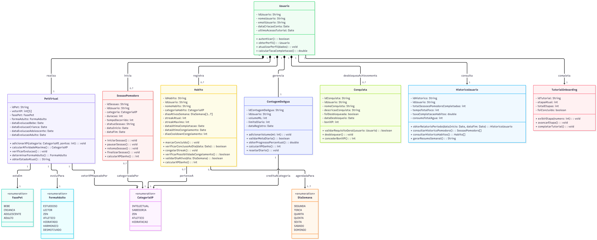

# SubEquipe_01
O relatório deverá conter a estrutura de focos estabelecida a seguir, bem como versionamentos, metodologia e participantes por foco.
Não omitir tópicos.

Este relatório registra as atividades da SubEquipe_01 na Entrega 02, dedicada à Modelagem UML. A estrutura preserva os focos exigidos para esta etapa e organiza os artefatos, metodologias, participantes, versionamentos e reflexões sobre IA Generativa.

## Focos do Relatório:
### FOCO_01: Modelagem Estática
### Participantes no Foco_01

      <a class="member-card" href="https://github.com/artmendess" target="_blank">
        
        <strong>Arthur Mendes Borges</strong>
        241010914
        <small>@artmendess</small>
      </a>
      <a class="member-card" href="https://github.com/lopes061" target="_blank">
        
        <strong>Enzo Lopes Ferreira</strong>
        232002000
        <small>@lopes061</small>
      </a>
      <a class="member-card" href="https://github.com/guin409" target="_blank">
        
        <strong>Guilherme Negreiros Pereira</strong>
        232014001
        <small>@guin409</small>
      </a>
    

### Metodologia do Foco_01

Para iniciar o processo de modelagem estática, realizamos uma consulta prévia a uma IA Generativa visando identificar quais diagramas da notação UML melhor se adequariam à arquitetura de um sistema gamificado. A inteligência artificial recomendou fortemente o uso do **Diagrama de Classes**. Essa sugestão foi acatada pela equipe, pois, conforme visto na literatura e em sala de aula, este é o diagrama estrutural mais relevante para o detalhamento estático. Ele reflete uma visão técnica muito próxima da implementação, evidenciando de forma clara as entidades do jogo, seus atributos, visibilidades e operações.

  
  

<em>Figura 1 e 2: Consulta inicial à IA Generativa sobre a melhor abordagem de modelagem estática.</em>

Com o tipo de modelo definido, optamos por utilizar a ferramenta **Mermaid**, seguindo as recomendações da disciplina. Para garantir que o modelo gerado possuísse alta fidelidade arquitetural, não escrevemos o diagrama do zero, mas adotamos uma estratégia de engenharia de *prompts*. Solicitamos a uma IA (Gemini) que atuasse como um Arquiteto de Software e traduzisse nossos Requisitos e Regras de Negócio para o inglês. Essa abordagem foi fundamental para otimizar a interpretação do contexto pela IA nativa do Mermaid. O *prompt* foi estruturado para exigir o cumprimento rigoroso das diretrizes da UML, forçando a definição correta de compartimentos, tipos de dados, multiplicidades e relacionamentos lógicos (como agregação e composição).

  
  
  

<em>Figura 3, 4 e 5: Prompt estruturado detalhando requisitos e regras de negócio para a IA do Mermaid.</em>

O resultado gerado pelo Mermaid foi altamente satisfatório. O modelo refletiu com precisão lógicas complexas do nosso sistema (como o vetor de experiência do *Pet Virtual*). Foram necessários apenas refinamentos pontuais e manuais em nomenclaturas de operações e atributos para adequação final. Para validar a consistência dessa modelagem, realizamos uma sessão de *peer review* (revisão por pares) comparando o nosso diagrama com o modelo elaborado pela Subequipe 3. Identificamos diversas semelhanças estruturais, o que comprovou um excelente alinhamento arquitetural entre as visões das duas equipes.

Para manter os rastros claros do nosso trabalho em equipe e das decisões tomadas, aproveitamos o contato com a Subequipe 3 para realizar um debate metodológico sobre o escopo do projeto. Discutimos abertamente quais funcionalidades seriam priorizadas ou descartadas. Entre as principais decisões arquiteturais, destacam-se:
1. **Substituição de mecânica:** Decidimos remover a complexidade de uma "loja de roupas" e substituí-la por um sistema global de conquistas e recompensas, mantendo o engajamento de forma mais elegante.
2. **Inclusão de Onboarding:** Validamos em conjunto a necessidade de adicionar um tutorial interativo à aplicação, reconhecido por todos como uma funcionalidade essencial para melhorar a usabilidade para novos usuários.

As evidências destas discussões e alinhamentos de escopo encontram-se registradas nas comunicações da equipe abaixo:

  
  
  
  

<em>Figura 6, 7, 8 e 9: Evidências da comunicação e tomada de decisão arquitetural entre as subequipes.</em>

### Modelo Estático

### FOCO_02: Modelagem Dinâmica
Entrega Mínima: um modelo dinâmico, na notação UML.
Mira-se no MM no FOCO, com a entrega mínima.
### Participantes no Foco_02

      <a class="member-card" href="https://github.com/artmendess" target="_blank">
        
        <strong>Arthur Mendes Borges</strong>
        241010914
        <small>@artmendess</small>
      </a>
      <a class="member-card" href="https://github.com/lopes061" target="_blank">
        
        <strong>Enzo Lopes Ferreira</strong>
        232002000
        <small>@lopes061</small>
      </a>
      <a class="member-card" href="https://github.com/guin409" target="_blank">
        
        <strong>Guilherme Negreiros Pereira</strong>
        232014001
        <small>@guin409</small>
      </a>
    

### Metodologia do Foco_02
Espaço para contar um pouco sobre como ocorreu o trabalho em equipe. Vídeos ajudam aqui.
### Modelo Dinâmico
Modelo dinâmico na notação UML.

#
### FOCO_03: IA Generativa
Entrega Mínima: pontos de vista de cada membro da equipe sobre as lições aprendidas e uso da IA Generativa.
TODOS DEVEM PARTICIPAR!
### Participantes no Foco_03
| Nome do Membro | Lições Aprendidas | Uso da IA Generativa (SENSO CRÍTICO) |
|---|---|---|
| Arthur Mendes Borges | O uso da IA Generativa contribuiu para compreender a importância de estruturar prompts, revisar criticamente respostas geradas e validar cada sugestão contra a organização real do Pages e os artefatos da Entrega 02. | A IA foi utilizada como apoio na criação, estruturação e elaboração do Pages, especialmente na organização de evidências, atas, participações e textos de rastreabilidade. As sugestões foram revisadas manualmente para preservar o padrão documental do projeto e evitar atribuições indevidas. [Relato em PDF](../assets/subEquipe01/RelatoUsoIAPages.pdf). |
| Guilherme Negreiros Pereira | A atividade evidenciou que a IA pode acelerar a padronização textual e a organização da documentação, mas exige validação humana constante para garantir coerência com os registros existentes, links, vídeos e estrutura das subequipes. | A IA foi empregada como ferramenta auxiliar para elaborar textos acadêmicos, revisar a clareza das evidências e apoiar a documentação do processo de criação do Pages. O uso teve caráter crítico, sem substituir a análise dos arquivos do repositório nem a tomada de decisão da equipe. [Relato em PDF](../assets/subEquipe01/RelatoUsoIAPages.pdf). |

#
## Versionamentos
| Nome do Membro | Contribuição | Comprobatórios Claros | Data |
|---|---|---|---|
| [Arthur Mendes Borges](https://github.com/artmendess) e [Guilherme Negreiros Pereira](https://github.com/guin409) | Reorganização da navegação e da home do Pages da Entrega 02, estruturação das participações e evidências de modelagem, e padronização dos relatórios de modelagem. | [Commit 487a831](https://github.com/UnBArqDsw2026-2-Turma02/2026.2-T02-_G4_ProjetoJogo_Entrega_02/commit/487a831), [Commit c479c0f](https://github.com/UnBArqDsw2026-2-Turma02/2026.2-T02-_G4_ProjetoJogo_Entrega_02/commit/c479c0f), [Commit d1d674f](https://github.com/UnBArqDsw2026-2-Turma02/2026.2-T02-_G4_ProjetoJogo_Entrega_02/commit/d1d674f) e [vídeo nas evidências](../Evidências/1.1.1.SubEquipe_01.md#preparação-do-pages-da-equipe). | 15/09/2026 |
| [Arthur Mendes Borges](https://github.com/artmendess)| Elaboração da metodologia do Foco 01 (Modelagem Estática), documentando a engenharia de prompts aplicada à geração do Diagrama de Classes, estruturação do grid de evidências visuais no Docsify e o registro das decisões arquiteturais.|  | 16/09/2026 |

EXEMPLO:
| Fulano | Elaboração do Diagrama de Classes, elaboração do Diagrama de Estados e ponto de vista sobre o uso de IA Generativa | Commits e evidências relacionadas | XX/XX/XXXX |
OBS: TODOS DEVEM PARTICIPAR, MOSTRANDO SEUS PONTOS DE VISTA E COMO COLABORARAM NA ENTREGA.

--
