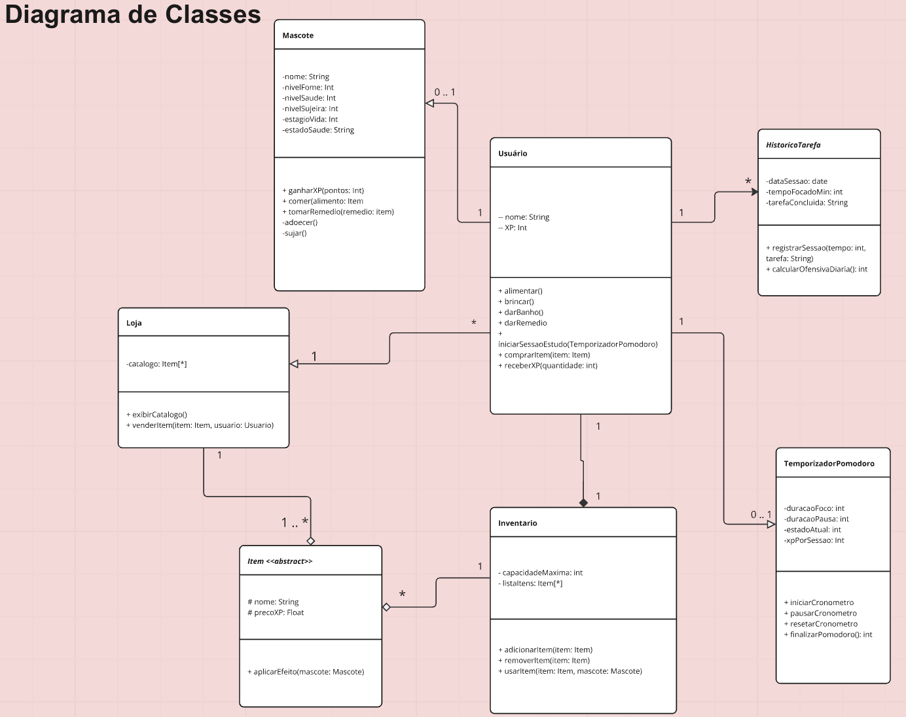
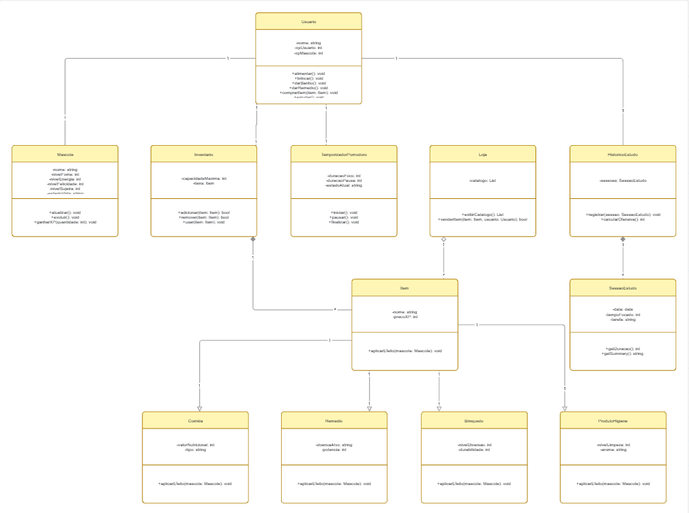
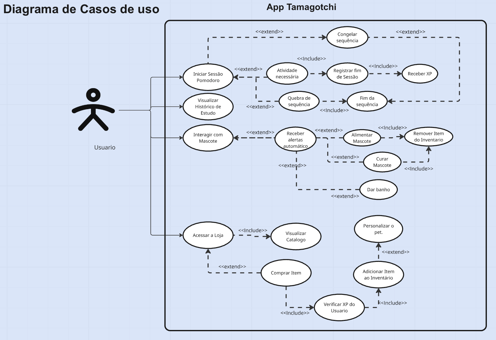
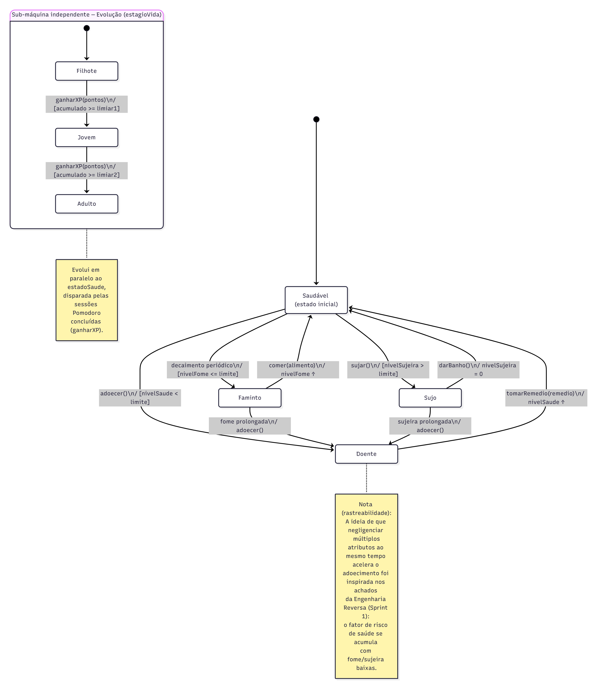
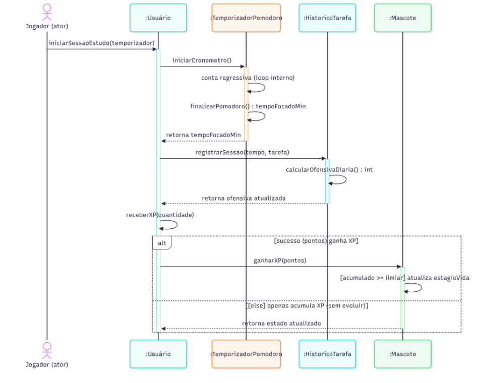

# SubEquipe_02
O relatório deverá conter a estrutura de focos estabelecida a seguir, bem como versionamentos, metodologia e participantes por foco.
Não omitir tópicos.

Este relatório registra as atividades da SubEquipe_02 na Entrega 02, dedicada à Modelagem UML. A estrutura preserva os focos exigidos para esta etapa e organiza os artefatos, metodologias, participantes, versionamentos e reflexões sobre IA Generativa.

## Focos do Relatório:
### FOCO_01: Modelagem Estática
Entrega Mínima: um modelo estático, na notação UML.
Mira-se no MM no FOCO, com a entrega mínima.
### Participantes no Foco_01

      <a class="member-card" href="https://github.com/Pabloo8" target="_blank">
        
        <strong>Pablo Cunha de Jesus</strong>
        222014910
        <small>@Pabloo8</small>
      </a>
      <a class="member-card" href="https://github.com/luabrantess" target="_blank">
        
        <strong>Ana Luiza Borba de Abrantes</strong>
        200014226
        <small>@Luabrantess</small>
      </a>
      <a class="member-card" href="https://github.com/auslogyc" target="_blank">
        
        <strong>Danilo Sarmento Barros</strong>
        222008468
        <small>@auslogyc</small>
      </a>

### Metodologia do Foco_01
A metodologia adotada para a concepção e modelagem deste foco baseou-se na identificação dos elementos essenciais de um ecossistema que une gamificação (bichinho virtual) e produtividade (método Pomodoro). A equipe realizou dinâmicas de ideação para estruturar as entidades principais e, com base no material "Arquitetura e Desenho de Software - Aula Modelagem UML Estática", definiu os atributos, métodos e a visibilidade de cada classe. Decidimos aplicar conceitos avançados da UML, como classes abstratas, herança (generalização), composição e agregação, para garantir uma arquitetura robusta e escalável.

### Modelo Estático
Modelo estático na notação UML.

#### Versão 1: Visão Geral de Classes

  
<b>Figura 1:</b> Diagrama de Classes - Visão Geral

  
<b>Fonte:</b> <a href="https://github.com/Pabloo8" target="_blank">Pablo Cunha de Jesus</a>, 2026.

#### Versão 2: Diagrama de Classes com Especialização de Itens e Sessões de Estudo

  
<b>Figura 2:</b> Diagrama de Classes com Especialização de Itens e Sessões de Estudo

  
<b>Fonte:</b> <a href="https://github.com/auslogyc" target="_blank">Danilo Sarmento Barros</a>, 2026. Rastro de elaboração disponível no <a href="https://miro.com/welcomeonboard/MTZuRXAwVk9ONDF0clZlT1F5eERkdFdsUGE3MjY2SWFWcHpQTTQzOURYalVoenlHWmR0M3Z5OVM4aWEwamxjbXg2cjRpUHhHanVRK1lpS1JwNC9DRCt4akNhV05KdHZ0dm1uc0trRDVaUFVDRjhublZ0YlI3RG1OSFYyL2VlU1NBd044SHFHaVlWYWk0d3NxeHNmeG9BPT0hdjE=?share_link_id=235811381197" target="_blank">Miro</a>.

#

### FOCO_02: Modelagem Dinâmica
### Participantes no Foco_02

      <a class="member-card" href="https://github.com/Pabloo8" target="_blank">
        
        <strong>Pablo Cunha de Jesus</strong>
        222014910
        <small>@Pabloo8</small>
      </a>
      <a class="member-card" href="https://github.com/auslogyc" target="_blank">
        
        <strong>Danilo Sarmento Barros</strong>
        222008468
        <small>@auslogyc</small>
      </a>
    

### Metodologia do Foco_02
O trabalho em equipe ocorreu de forma assíncrona, permitindo que cada integrante desenvolvesse suas atividades de acordo com sua disponibilidade. A comunicação e o acompanhamento das tarefas foram realizados por meio de ferramentas digitais, possibilitando o compartilhamento de informações, documentos e resultados entre os integrantes. Dessa forma, as contribuições individuais foram integradas ao longo do desenvolvimento do trabalho, mantendo a organização e o acompanhamento das atividades.

### Modelo Dinâmico
Modelo dinâmico na notação UML.

  
<b>Figura 3:</b> Diagrama de Casos de Uso

  
<b>Fonte:</b> <a href="https://github.com/Pabloo8" target="_blank">Pablo Cunha de Jesus</a>, 2026.

  
<b>Figura 1:</b> Diagrama de Classes - Visão Geral

  
<b>Fonte:</b> <a href="https://github.com/jvopBR" target="_blank">João Vitor Mendonça Merlin</a>, 2026.

  
<b>Figura 1:</b> Diagrama de Sequência - Visão Geral

  
<b>Fonte:</b> <a href="https://github.com/jvopBR" target="_blank">João Vitor Mendonça Merlin</a>, 2026.

#
### FOCO_03: IA Generativa
Entrega Mínima: pontos de vista de cada membro da equipe sobre as lições aprendidas e uso da IA Generativa.
TODOS DEVEM PARTICIPAR!
### Participantes no Foco_03
| Nome do Membro | Lições Aprendidas | Uso da IA Generativa (SENSO CRÍTICO) |
|---|---|---|
| Pablo Cunha | Durante as modelagens, as primeiras versões dos diagramas de classe e de Casos de Uso foram elaboradas sem a utilização de uma tabela de requisitos, o que gerou bastante duvida na abstração de um escopo complexo que une a produtividade e gamificação. Como principal lição aprendida, ficou evidente que ter uma boa organização prévia dos processos ajuda bastante na hora de elaborar os diagramas. Após a criação e análise da tabela de requisitos, foram feitas melhorias em ambos os modelos para corrigir o alinhamento de arquitetura do projeto. | Nessa entrega, utilizei a IA Generativa principalmente para a formatação e padronização dos arquivos em .md e, na etapa de modelagem, a ferramenta me auxiliou bastante com a organização das entidades e a definição do escopo geral da arquitetura. Apesar da agilidade e tempo salvo, o uso da IA exigiu a aplicação constante de senso crítico, tendo que ser revisada sempre. Durante o mapeamento do Diagrama de Casos de Uso, por exemplo, a ferramenta sugeriu um encadeamento incorreto para alguns fluxos, conectando relacionamentos obrigatórios (<<include>>) de forma inadequada, o que criava falhas na lógica de negócio. |
| Ana Luiza Borba de Abrantes |  Durante o trabalho, utilizei a IA generativa como ferramenta de apoio para comparação e análise, principalmente para identificar detalhes e aspectos que poderiam estar faltando no material desenvolvido. A utilização da IA possibilitou observar o trabalho sob diferentes perspectivas, trazendo pontos de vista que inicialmente não haviam sido considerados pela equipe. | Como principal aprendizado, percebi que a IA pode contribuir para ampliar a análise e auxiliar na identificação de melhorias, mas suas sugestões não devem ser aceitas automaticamente. Foi necessário aplicar senso crítico, avaliando cada sugestão, verificando sua coerência com o contexto do projeto e decidindo quais contribuições realmente agregavam valor ao resultado final. Dessa forma, a IA foi utilizada como apoio ao processo de análise e tomada de decisão, e não como substituta da avaliação humana. |
| Danilo Sarmento Barros |  |  |

#
## Versionamentos
| Nome do Membro | Contribuição | Comprobatórios Claros | Data |
|---|---|---|---|
| [Pablo Cunha de Jesus](https://github.com/Pabloo8) | [Elaboração do Diagrama de Classes e do Diagrama de Casos de Uso](../Relatórios/1.1.2.SubEquipe_02.md) | 
[Commit 0e60b0d](https://github.com/UnBArqDsw2026-2-Turma02/2026.2-T02-_G4_ProjetoJogo_Entrega_02/commit/0e60b0d1a1af9595e84e663444253f766c2a777e) | 15/09/2026 |

| [Ana Luiza Borba de Abrantes](https://github.com/luabrantess) | [Aprovação do Diagrama de Casos de Uso por meio do uso de IA para comparar ambos, identificado que faltou algumas regras](../Relatórios/1.1.2.SubEquipe_02.md) | [Melhoria por IA do diagrama de casos de uso](../Evidências/1.1.2.SubEquipe_02.md#evidências-de-elaboração-dos-artefatos) | 16/09/2026 |
| [Ana Luiza Borba de Abrantes](https://github.com/luabrantess) | [Aprovação do Diagrama de Casos de Uso por meio da lista de requisitos para comparar ambos, identificado que faltou algumas regras](../Relatórios/1.1.2.SubEquipe_02.md) | [Melhoria por requisitos do diagrama de casos de uso](../Evidências/1.1.2.SubEquipe_02.md#evidências-de-elaboração-dos-artefatos) | 17/09/2026 |
| [Ana Luiza Borba de Abrantes](https://github.com/luabrantess) | [Aprovação do Diagrama de Classe por meio da lista de requisitos para comparar ambos, identificado que faltou algumas regras](../Relatórios/1.1.2.SubEquipe_02.md) | [Melhoria por requisitos do diagrama de classesxs](../Evidências/1.1.2.SubEquipe_02.md#evidências-de-elaboração-dos-artefatos) | 17/09/2026 |
| [Danilo Sarmento Barros](https://github.com/auslogyc) | Elaboração do Diagrama de Classes (com especialização de Itens e Sessões de Estudo) | [Diagrama de Classes v2](../assets/subEquipe02/diagramaDeClasses_v2.png) e [Rastro no Miro](https://miro.com/welcomeonboard/MTZuRXAwVk9ONDF0clZlT1F5eERkdFdsUGE3MjY2SWFWcHpQTTQzOURYalVoenlHWmR0M3Z5OVM4aWEwamxjbXg2cjRpUHhHanVRK1lpS1JwNC9DRCt4akNhV05KdHZ0dm1uc0trRDVaUFVDRjhublZ0YlI3RG1OSFYyL2VlU1NBd044SHFHaVlWYWk0d3NxeHNmeG9BPT0hdjE=?share_link_id=235811381197) | 17/09/2026 |
| [Pablo Cunha de Jesus](https://github.com/Pabloo8) | [Adição do Diagrama de Estados e do Diagrama de Sequência](../Relatórios/1.1.2.SubEquipe_02.md#foco_02-modelagem-dinâmica) | [Commit 77576e9](https://github.com/UnBArqDsw2026-2-Turma02/2026.2-T02-_G4_ProjetoJogo_Entrega_02/commit/77576e90f4a40b4b1105b511e1f4e515b85d69d0)| 17/09/2026 |
| [Pablo Cunha de Jesus](https://github.com/Pabloo8) | Alteração do tipo de arquivo ( Diagrama de Estado e Sequencia) | [Commit 96e7a71](https://github.com/UnBArqDsw2026-2-Turma02/2026.2-T02-_G4_ProjetoJogo_Entrega_02/commit/96e7a71eb6a90762642b73df8e595b01afd0a3e8) | 17/09/2026 |
| [Pablo Cunha de Jesus](https://github.com/Pabloo8) | [Inclusão do Foco 03 - Minhas Lições aprendidas e Uso de IA Generativa](../Relatórios/1.1.2.SubEquipe_02.md#foco_03-ia-generativa) | [Commit d05ccbf](https://github.com/UnBArqDsw2026-2-Turma02/2026.2-T02-_G4_ProjetoJogo_Entrega_02/commit/d05ccbff9a8cebedf327feac0885caffce5e6666) | 17/09/2026 |

--
# Observações: 
Entregável: Relatório, documentado no GitPages, revelando:
## Entrega Mínima (por subgrupo da equipe): um modelo estático na notação UML, um modelo dinâmico na notação UML, e pontos de vista de cada membro da equipe sobre as lições aprendidas e uso da IA Generativa. Mira-se no MM, com a entrega mínima.

## Como ir além, para conseguir menções superiores?
Embasar cada artefato gerado e cada decisão tomada na literatura;
Manter rastros claros para o trabalho em equipe (ex. vídeos das reuniões e atas bem elaboradas), evidenciando práticas metodológicas (ex. reuniões periódicas das metodologias ágeis; checklists; debates, e assim vai);
Usar os vários recursos de modelagem da notação UML, e
Reportar os pontos de vista de forma fundamentada, clara e com senso crítico.

## 📌A ideia não é quantidade, e sim qualidade do que é entregue.

## Apresentação:
Apresentação (para a professora) explicando o artefato elaborado, com: (i) rastro claro aos membros participantes (MOSTRAR QUADRO DE PARTICIPAÇÕES & COMMITS); (ii) justificativas & senso crítico sobre o trabalho realizado, e (iii) comentários gerais sobre o trabalho em equipe. Tempo da Apresentação: +/- 10min. Recomendação: Apresentar diretamente via Wiki ou GitPages do Projeto. Baixar os conteúdos com antecedência, evitando problemas de internet no momento de exposição nas Dinâmicas de Avaliação.

A Wiki ou GitPages do Projeto deve conter, PARA CADA SUBGRUPO, um tópico dedicado ao relatório com a entrega mínima, versionamentos, referências, e demais detalhamentos gerados pela equipe nesse escopo.
Demais orientações disponíveis nas Diretrizes (vide Aprender3).
