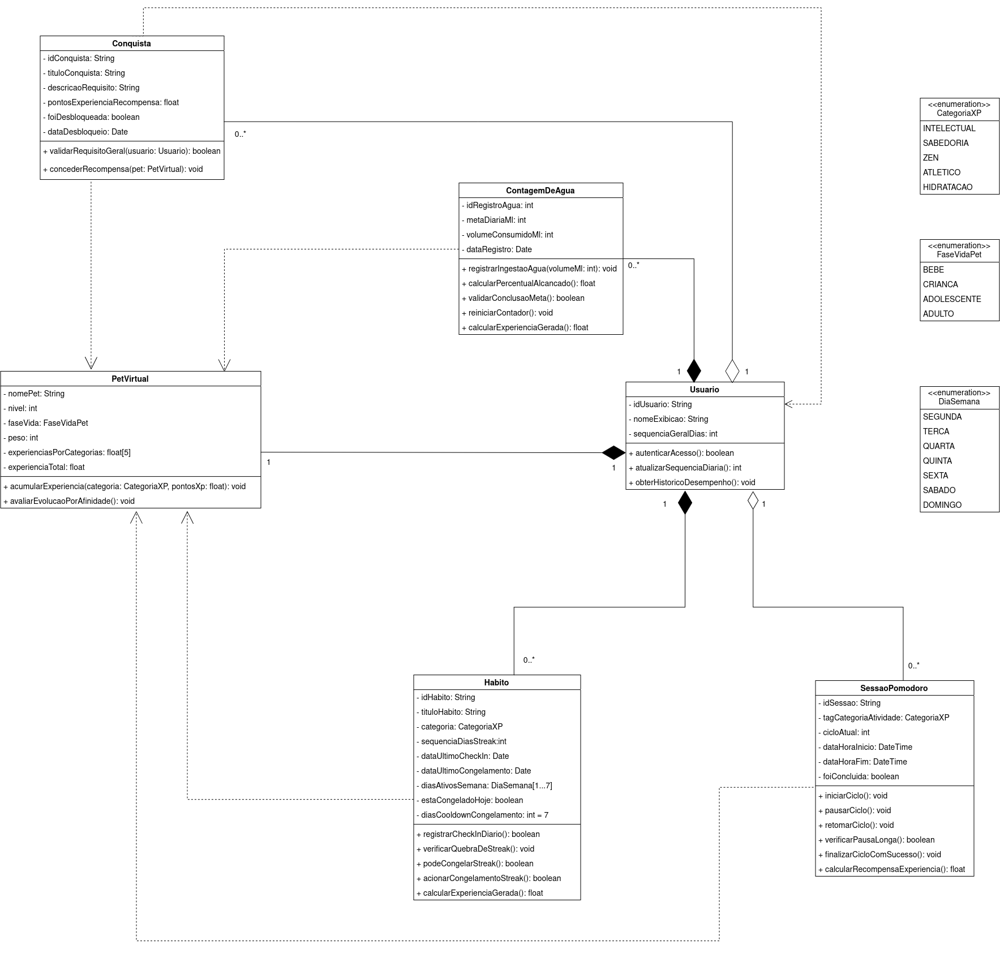
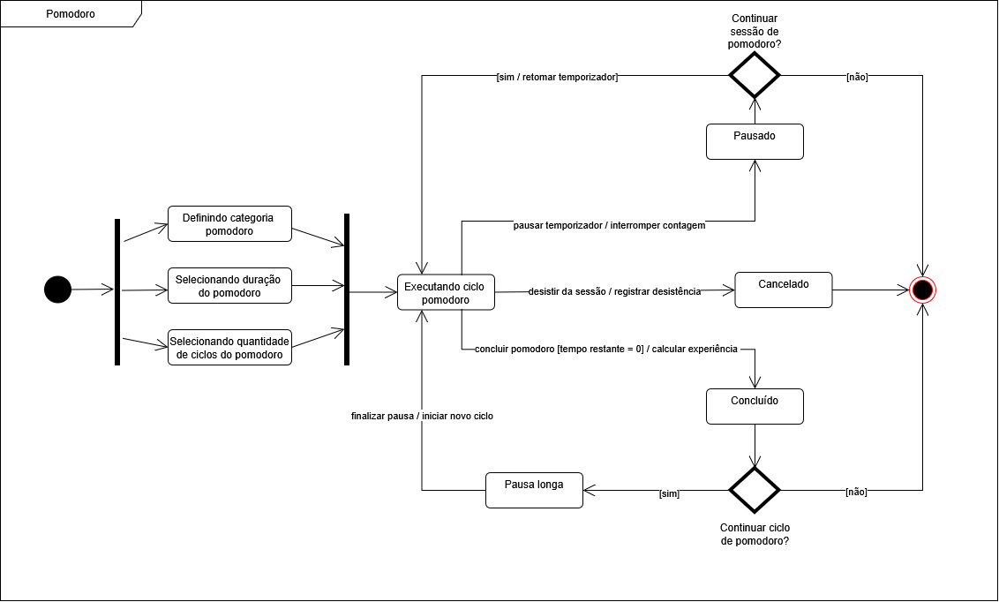
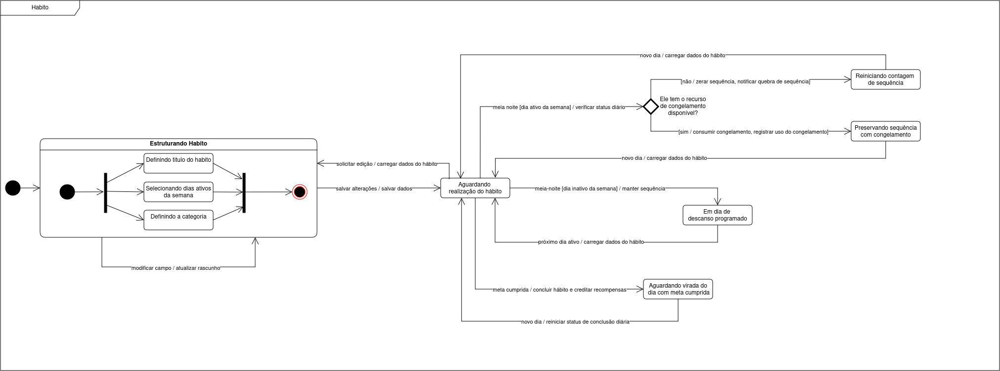

# SubEquipe_03
O relatório deverá conter a estrutura de focos estabelecida a seguir, bem como versionamentos, metodologia e participantes por foco.
Não omitir tópicos.

Este relatório registra as atividades da SubEquipe_03 na Entrega 02, dedicada à Modelagem UML. A estrutura preserva os focos exigidos para esta etapa e organiza os artefatos, metodologias, participantes, versionamentos e reflexões sobre IA Generativa.

## Focos do Relatório:
### FOCO_01: Modelagem Estática
Entrega Mínima: um modelo estático, na notação UML.
Mira-se no MM no FOCO, com a entrega mínima.
### Participantes no Foco_01

      <a class="member-card" href="https://github.com/bielg7" target="_blank">
        
        <strong>Gabriel Pereira da Silva</strong>
        221008641
        <small>@bielg7</small>
      </a>
      <a class="member-card" href="https://github.com/EduardoRGS" target="_blank">
        
        <strong>Eduardo Ribeiro Gomes da Silva</strong>
        190027011
        <small>@EduardoRGS</small>
      </a>
      <a class="member-card" href="https://github.com/vevetin" target="_blank">
        
        <strong>Weverton Rodrigues da Costa Silva</strong>
        221022767
        <small>@vevetin</small>
      </a>
    

### Metodologia do Foco_01

A construção da modelagem estática do sistema baseou-se em um processo iterativo de abstração e alinhamento da equipe, fundamentado na especificação da *Unified Modeling Language* (UML 2.5) e na literatura de Engenharia de Software [(BOOCH; JACOBSON; RUMBAUGH, 2000; GUEDES, 2011)](../Relatórios/1.1.3.SubEquipe_03.md#referências). A padronização da notação orientada a objetos, incluindo visibilidades, multiplicidades e tipos de relacionamentos, foi realizada com base nas orientações didáticas de modelagem arquitetural da disciplina [(SERRANO, 2026)](../Relatórios/1.1.3.SubEquipe_03.md#referências), complementadas por conteúdos audiovisuais sobre UML [(BOSON TREINAMENTOS, 2018)](../Relatórios/1.1.3.SubEquipe_03.md#referências) e pela documentação técnica do portal *UML Diagrams* [(UML-DIAGRAMS.ORG, c2009-2026)](../Relatórios/1.1.3.SubEquipe_03.md#referências). O objetivo desta etapa foi estruturar conceitualmente as entidades do domínio e seus papéis, organizando as definições do produto em um modelo consistente e legível.

Durante as sessões iniciais de elicitação e detalhamento do escopo, ocorreu um debate sobre a identidade do aplicativo entre os integrantes do subgrupo [(SUBGRUPO 03, 2026a)](../Relatórios/1.1.3.SubEquipe_03.md#referências). A partir da análise de engenharia reversa das patentes originais de consoles portáteis de pets virtuais [(YOKOI, 1999, 2001)](../Relatórios/1.1.3.SubEquipe_03.md#referências), avaliou-se a manutenção de mecânicas clássicas de pets virtuais, como o gerenciamento de cuidados biológicos, incluindo alimentação simulada, limpeza de resíduos e saúde, além de um fluxo de loja virtual com moedas acumuláveis. Inicialmente, Gabriel defendeu que esses elementos eram fundamentais para caracterizar a aplicação como um jogo interativo, evitando que se tornasse apenas um utilitário convencional. Em contrapartida, Weverton argumentou que a manutenção biológica artificial tornava a experiência punitiva e a afastava do objetivo central de produtividade e autorregulação do usuário.

Após rodadas de alinhamento e análise de requisitos, a equipe alcançou o consenso de que o produto deveria se consolidar como um **utilitário gamificado de produtividade e hábitos**. Nessa abordagem, o crescimento do pet deixa de ser guiado por rotinas simuladas e passa a ser impulsionado por ações reais de autocuidado e foco, como o uso de temporizadores Pomodoro, o acompanhamento da hidratação e o cumprimento de rotinas. Com isso, os fluxos de loja virtual e as moedas fictícias foram descartados em favor de uma estrutura mais objetiva e funcional.

Definida a orientação do produto, a equipe iniciou o mapeamento conceitual das entidades do domínio [(SUBGRUPO 03, 2026b)](../Relatórios/1.1.3.SubEquipe_03.md#referências). A modelagem das classes foi iniciada conjuntamente pelos integrantes, com a definição das principais entidades e de suas características. Na continuidade desse trabalho, Weverton ficou responsável pela finalização das abstrações que ainda estavam pendentes no modelo. Uma decisão relevante tomada durante essa etapa foi a separação explícita entre a gestão de rotinas diárias e o sistema de conquistas. Em vez de unificar o progresso em um único bloco, os hábitos foram isolados em um conceito dedicado ao acompanhamento da frequência e da consistência das rotinas, enquanto as conquistas foram modeladas de forma independente, representando marcos globais de desempenho e recompensas de longo prazo.

Com as entidades de domínio mapeadas, Eduardo e Gabriel assumiram a responsabilidade de estruturar e desenhar os relacionamentos, as multiplicidades e a navegabilidade entre os elementos [(SUBGRUPO 03, 2026b)](../Relatórios/1.1.3.SubEquipe_03.md#referências). Em reunião posterior de revisão e validação das conexões [(SUBGRUPO 03, 2026c)](../Relatórios/1.1.3.SubEquipe_03.md#referências), o subgrupo reavaliou o uso de composições e agregações, seguindo as diretrizes de acoplamento da UML [(UML-DIAGRAMS.ORG, c2009-2026)](../Relatórios/1.1.3.SubEquipe_03.md#referências). As estruturas criadas e gerenciadas estritamente pelo perfil do usuário mantiveram o vínculo de composição. Outras entidades foram modeladas como agregações ou associações quando se reconheceu que suas especificações ou catálogos possuem existência conceitual independente da instância de um usuário ativo.

Além disso, para evitar a poluição visual do diagrama e preservar sua clareza, o grupo optou por não desenhar linhas explícitas de relacionamento para as enumerações, como categorias de XP, fases de vida e dias da semana.

> **Evidências:** as explicações em vídeo, as evidências de elaboração dos artefatos e as atas de reuniões estão disponíveis na seção de [Evidências da SubEquipe_03](../Evidências/1.1.3.SubEquipe_03.md).

### Modelo Estático

O Diagrama de Classes apresentado na Figura 1 representa a estrutura estática e orientada a objetos da aplicação, definindo as entidades do domínio e seus relacionamentos, multiplicidades e visibilidades. O modelo tem como elemento central o perfil do usuário, responsável por gerenciar seu pet virtual e realizar as atividades previstas no sistema por meio das classes relacionadas ao acompanhamento de foco, hábitos e hidratação. A evolução do pet é determinada pelo desempenho do usuário nessas atividades: a conclusão de blocos de foco, rotinas diárias e metas de ingestão de água contribui para o ganho de experiência em diferentes categorias. Paralelamente, o módulo de conquistas registra marcos de desempenho e recompensa a consistência do usuário ao longo do tempo.

<b>Figura 1</b> - Diagrama de Classes do Sistema Pet Virtual Gamificado

Autores: Gabriel Pereira, Eduardo Ribeiro e Weverton Rodrigues

### FOCO_02: Modelagem Dinâmica
Entrega Mínima: um modelo dinâmico, na notação UML.
Mira-se no MM no FOCO, com a entrega mínima.
### Participantes no Foco_02

      <a class="member-card" href="https://github.com/bielg7" target="_blank">
        
        <strong>Gabriel Pereira da Silva</strong>
        221008641
        <small>@bielg7</small>
      </a>
      <a class="member-card" href="https://github.com/EduardoRGS" target="_blank">
        
        <strong>Eduardo Ribeiro Gomes da Silva</strong>
        190027011
        <small>@EduardoRGS</small>
      </a>
      <a class="member-card" href="https://github.com/vevetin" target="_blank">
        
        <strong>Weverton Rodrigues da Costa Silva</strong>
        221022767
        <small>@vevetin</small>
      </a>
    

### Metodologia do Foco_02

A construção da modelagem dinâmica do sistema teve como objetivo representar o comportamento e o ciclo de vida das entidades centrais da aplicação, empregando o Diagrama de Estados da especificação UML. Para garantir a fidelidade à notação orientada a objetos e esclarecer dúvidas estruturais, a equipe utilizou como base de consulta a documentação técnica do portal UML Diagrams (UML-DIAGRAMS.ORG, c2009-2026) e o material de apoio disponibilizado no site da disciplina (SERRANO, 2026), que serviu de referência por meio de exemplos práticos de modelagem. A partir do modelo estático previamente consolidado, a equipe mapeou os fluxos de transição para assegurar que a lógica de negócio do utilitário de produtividade operasse de forma consistente. Como apoio técnico nesta fase, o grupo explorou ferramentas de inteligência artificial para a prototipação inicial das estruturas em PlantUML. Em seguida, a confecção final e o refinamento visual dos diagramas foram realizados utilizando a plataforma Draw.io ([DRAW.IO](../Relatórios/1.1.3.SubEquipe_03.md#referências)), iterando sobre os modelos durante as sessões de desenvolvimento conjunto.

O primeiro artefato elaborado focou na classe `SessaoPomodoro` [(SUBGRUPO 03, 2026a)](../Relatórios/1.1.3.SubEquipe_03.md#referências). A modelagem delineou o passo a passo da funcionalidade, iniciando com nós de bifurcação e junção (*fork/join*) para gerenciar simultaneamente a seleção de categorias de XP e as configurações de tempo. O fluxo seguiu mapeando a execução do foco, a concessão de experiência (XP) ao término das sessões e o tratamento de cancelamentos antecipados, garantindo que interrupções por parte do usuário encerrassem o estado sem atribuição indevida de progresso.

Em etapa subsequente de revisão e aplicação de *feedbacks* acadêmicos [(SUBGRUPO 03, 2026b)](../Relatórios/1.1.3.SubEquipe_03.md#referências), o subgrupo promoveu ajustes fundamentais na semântica visual do diagrama. O debate concentrou-se na aplicação rigorosa dos nós de decisão (*gateways*). Para evitar ambiguidades, foram adicionadas perguntas de contexto diretamente nos losangos de decisão, acompanhadas de respostas diretas nas setas de transição, separando conceitualmente as ações de "iniciar novo ciclo" e "encerrar sessão". O gerenciamento das pausas também foi estruturado detalhadamente, determinando a transição para pausas longas após a conclusão de três ciclos normais contínuos.

Ao deliberar sobre os próximos artefatos da entrega, a equipe cogitou modelar os estados do `Pet Virtual`. No entanto, a proposta foi descartada ao constatar-se que a evolução do pet funcionaria essencialmente como um fluxograma lógico simples, não justificando a densidade de um Diagrama de Estados. Consequentemente, o grupo definiu a classe de `Hábitos` como o segundo alvo da modelagem dinâmica [(SUBGRUPO 03, 2026b)](../Relatórios/1.1.3.SubEquipe_03.md#referências).

Para o diagrama de `Hábitos` [(SUBGRUPO 03, 2026c)](../Relatórios/1.1.3.SubEquipe_03.md#referências), a principal complexidade residia em estruturar a etapa de cadastro e o comportamento autônomo do sistema. A equipe resolveu o passo de configuração implementando um estado composto (subfluxo) batizado de `Estruturando Hábito`, que encapsula a seleção dos dias ativos e a definição da categoria antes da entrada no fluxo de verificação diária. Outra discussão central envolveu o processamento lógico da virada do dia (evento de meia-noite). Para solucionar a mecânica de penalidades e *streaks* (ofensivas), foram integrados *gateways* com a checagem "Possui recurso de congelamento (*freeze*) disponível?", definindo assim a manutenção ou a reinicialização da sequência do usuário. Transições auxiliares para edição também foram mapeadas, viabilizando o ajuste de parâmetros sem invalidar o estado atual do hábito.

> **Evidências:** as explicações em vídeo, as evidências de elaboração dos artefatos e as atas de reuniões estão disponíveis na seção de [Evidências da SubEquipe_03](../Evidências/1.1.3.SubEquipe_03.md).

### Modelos Dinâmicos

Os Diagramas de Estados gerados detalham o comportamento lógico-temporal dos dois motores de progressão da aplicação.

O Diagrama de Estados da `SessaoPomodoro`, apresentado na **Figura 1**, ilustra o ciclo de vida completo da funcionalidade, englobando as etapas de configuração, os ciclos de foco alternados com pausas curtas e longas, e os caminhos de encerramento que culminam na pontuação de experiência.

Já o Diagrama de Estados de `Hábitos`, apresentado na **Figura 2**, representa a dinâmica do acompanhamento de rotinas, evidenciando o subfluxo de criação (`Estruturando Hábito`), as lógicas de verificação diária (incluindo o consumo de recursos de congelamento para preservação de ofensivas) e os caminhos secundários para alteração de propriedades ao longo da vida útil do hábito registrado pelo usuário.

<b>Figura 1</b> - Diagrama de Estados do Pomodoro

Autores: Gabriel Pereira, Eduardo Ribeiro e Weverton Rodrigues

<b>Figura 2</b> - Diagrama de Estados dos Hábitos

Autores: Gabriel Pereira, Eduardo Ribeiro e Weverton Rodrigues

### FOCO_03: IA Generativa

### Participantes no Foco_03

| Nome do Membro | Lições Aprendidas | Uso da IA Generativa (SENSO CRÍTICO) |
|---|---|---|
| [Eduardo Ribeiro](https://github.com/eduardorgs) |  |  |
| [Gabriel Pereira](https://github.com/bielg7) |  |  |
| [Weverton Rodrigues](https://github.com/vevetin) |  |  |

### Evidências de uso da IA Generativa

| Material | Descrição | Link |
|---|---|---|

## Referências

- BOOCH, Grady; RUMBAUGH, James; JACOBSON, Ivar. UML: guia do usuário. Rio de Janeiro: Campus, 2000.

- BOSON TREINAMENTOS. Curso de UML - Unified Modeling Language. YouTube, 26 set. 2018. 1 playlist (11 vídeos). Disponível em: https://youtube.com/playlist?list=PLucm8g_ezqNqCRGHGHoacCo6N1bfN7hXZ&si=t5JsUAklnosft4zo. Acesso em: 14 set. 2026.

- GUEDES, Gilleanes T. A. UML 2: uma abordagem prática. 2. ed. São Paulo: Novatec, 2011.

- SERRANO, Milene. Aula - Modelagem UML Estática. Brasília: Universidade de Brasília, 2026. Material didático da disciplina Arquitetura e Desenho de Software.

- SUBGRUPO 03. Reunião 13/09/2026 (SubGrupo 03). Gravação em vídeo referente ao alinhamento inicial do grupo. Brasília: Universidade de Brasília, 13 set. 2026a. [1 vídeo](../Evidências/1.1.3.SubEquipe_03.md).

- SUBGRUPO 03. Reunião 14/09/2026 (SubGrupo 03). Gravação em vídeo referente à construção do diagrama de classes. Brasília: Universidade de Brasília, 14 set. 2026b. [1 vídeo](../Evidências/1.1.3.SubEquipe_03.md).

- SUBGRUPO 03. Reunião 15/09/2026 (SubGrupo 03). Gravação em vídeo referente à revisão de relacionamentos e escopo. Brasília: Universidade de Brasília, 15 set. 2026c. [1 vídeo](../Evidências/1.1.3.SubEquipe_03.md).

- SUBGRUPO 03. Reunião 16/09/2026 (SubGrupo 03). Gravação em vídeo referente à revisão de relacionamentos e escopo. Brasília: Universidade de Brasília, 16 set. 2026c. [2 vídeos](../Evidências/1.1.3.SubEquipe_03.md).

- UML-DIAGRAMS.ORG. The Unified Modeling Language. c2009-2026. Disponível em: https://www.uml-diagrams.org/. Acesso em: 16 set. 2026.

- DRAW.IO. draw.io: diagrams online. [S. l.]: draw.io, [s. d.]. Disponível em: https://www.drawio.com/. Acesso em: 16 set. 2026.

- YOKOI, Akihiro. Simulation device for fostering a virtual creature. Depositantes: Kabushiki Kaisha Bandai; Kabushiki Kaisha Wiz. US n. 5,966,526. Depósito: 11 jun. 1997. Concessão: 12 out. 1999.

- YOKOI, Akihiro. Nurturing simulation apparatus for virtual creatures. Depositantes: Kabushiki Kaisha Bandai; Kabushiki Kaisha Wiz. US n. 6,213,871 B1. Depósito: 19 fev. 1997. Concessão: 10 abr. 2001.

## Versionamentos
| Nome do Membro | Contribuição | Data |
|---|---|---|
| [Gabriel Pereira](https://github.com/bielg7), [Eduardo Ribeiro](https://github.com/EduardoRGS) e [Weverton Rodrigues](https://github.com/vevetin)| Mapeamento inicial das entidades do domínio e construção da primeira versão do Diagrama de Classes. | 14/09/2026 | 
| [Gabriel Pereira](https://github.com/bielg7), [Eduardo Ribeiro](https://github.com/EduardoRGS) e [Weverton Rodrigues](https://github.com/vevetin) | Revisão dos relacionamentos, ajuste das linhas de dependência e refinamento visual do diagrama. | 15/09/2026 | 
| [Weverton Rodrigues](https://github.com/vevetin) | Redação da metodologia da modelagem estática (FOCO 01), fundamentação teórica, citações e referências no padrão ABNT. | 16/09/2026 |
| [Eduardo Ribeiro](https://github.com/eduardorgs) | Redação da metodologia da modelagem estática (FOCO 02), fundamentação teórica, citações e referências no padrão ABNT. | 17/09/2026 |